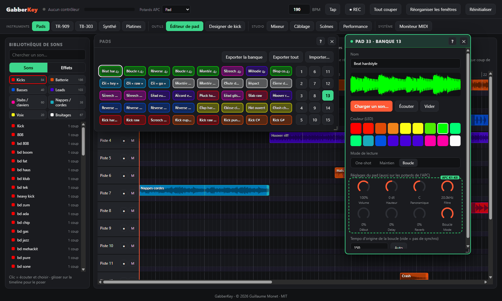
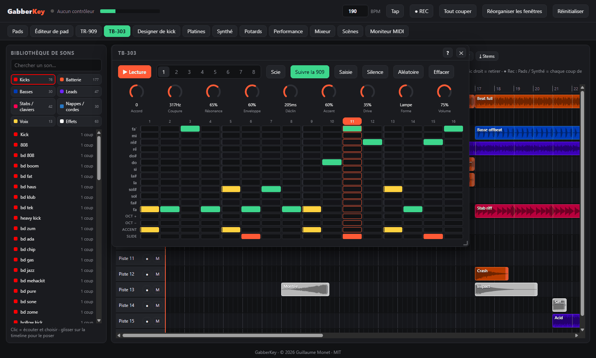
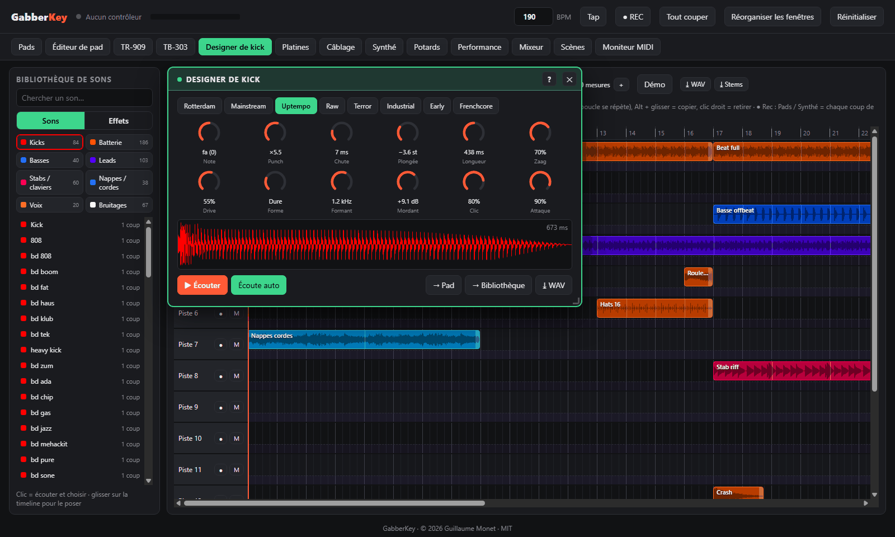
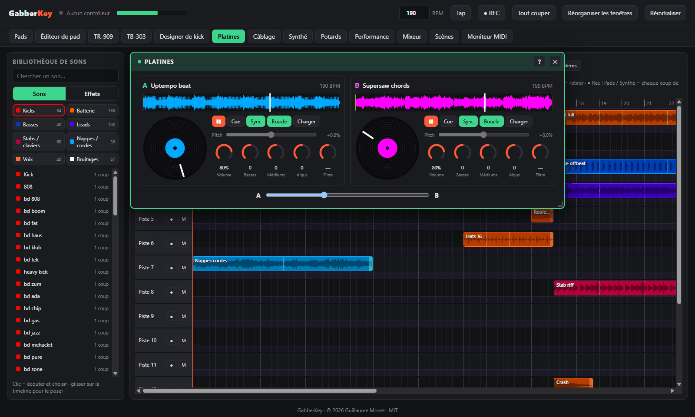
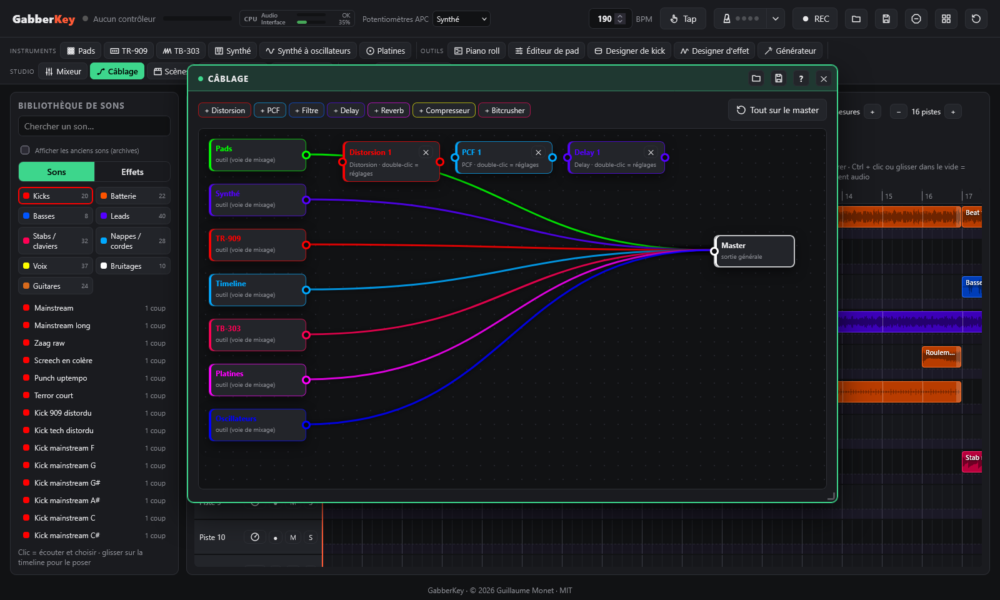
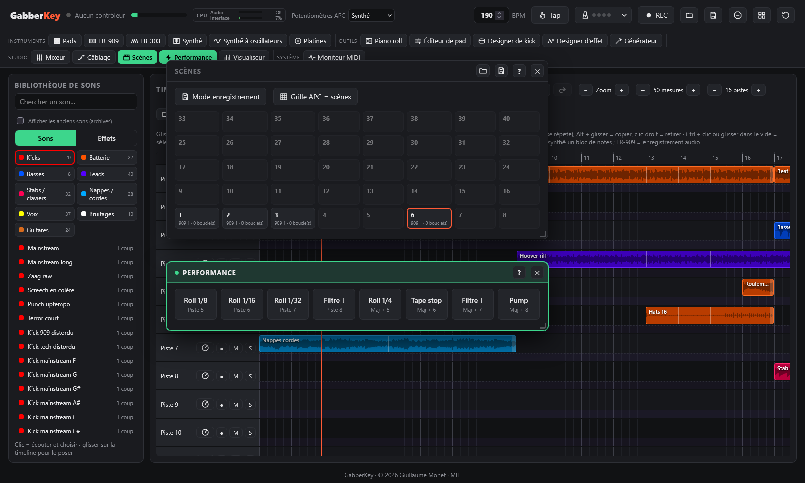
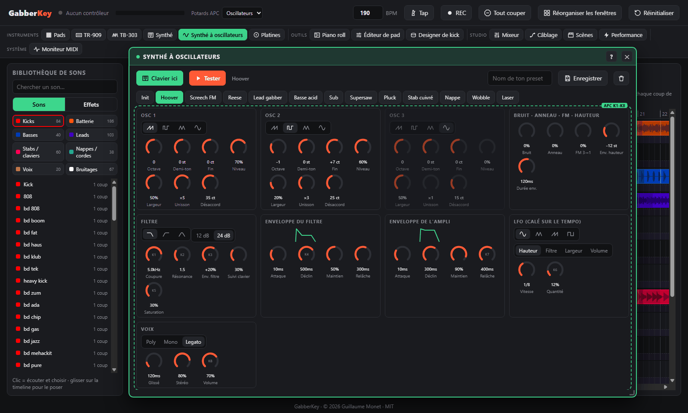
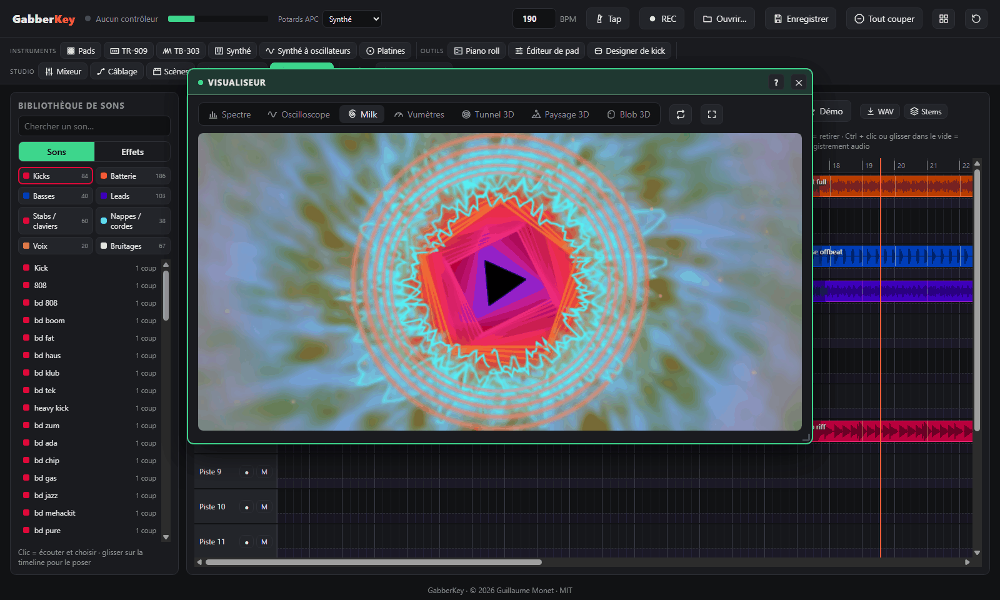
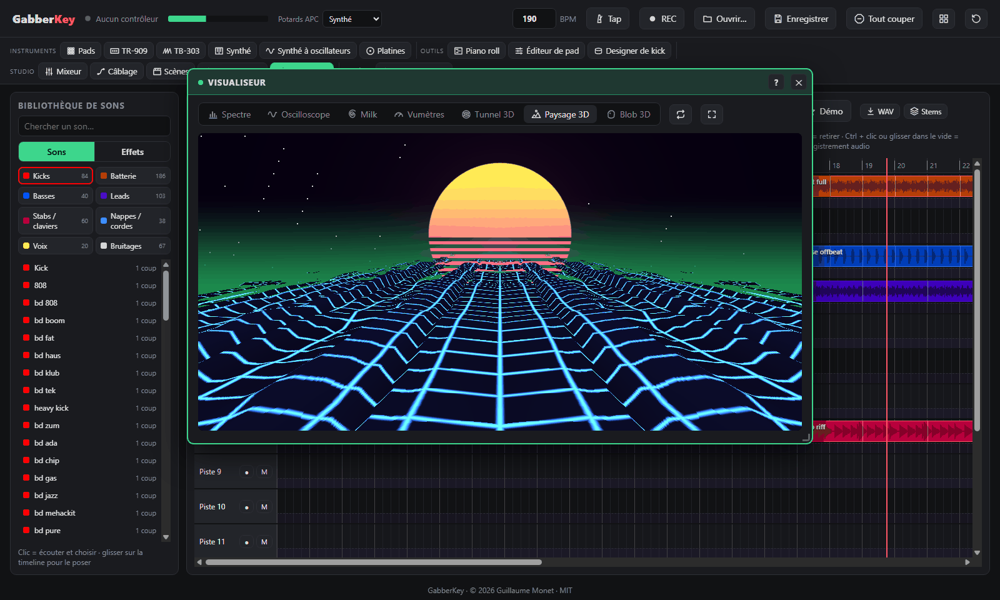
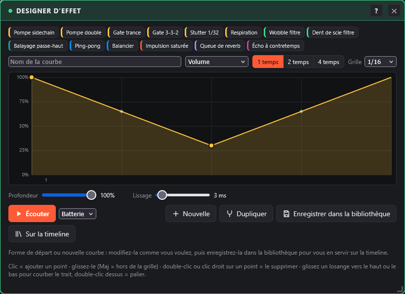

# GabberKey

**Un studio de musique complet dans le navigateur, né pour le hardcore / gabber, joué avec un Akai APC Key 25.**

*Par Guillaume Monet* · [English version](README.md) · [☕ Soutenir le projet](https://paypal.me/holythunderblade)

GabberKey s'organise autour d'une **timeline** : on glisse des sons d'une bibliothèque rangée par catégorie sur des pistes, les blocs se calent à la mesure et tout joue au même tempo. Les autres outils (pads du sampler, TR-909, synthé, table de mixage, effets…) sont des **plugins** qui s'ouvrent dans des fenêtres, et l'Akai APC Key 25 (mk1 ou mk2) les joue en direct. Rien à installer à part un navigateur :

- **Timeline** : 16 pistes au départ (jusqu'à 64), chacune avec ses potentiomètres (volume, pano, filtres, envois) ; glisser, allonger (les boucles se répètent), copier et déplacer des blocs ; jouez les pads ou le clavier pendant l'enregistrement et chaque coup devient un bloc, en direct, et les notes du synthé un bloc de notes ; retouchez les notes dans un **piano roll** ; la TR-909 s'enregistre en audio ; sélectionnez plusieurs blocs et copiez / collez-les.
- **Bibliothèque de sons** : 798 sons rangés en Kicks, Batterie, Basses, Leads, Stabs / claviers, Nappes / cordes, Voix, Effets et Guitares, à commencer par les nouvelles banques **Anthem** (200 sons faits pour construire un hymne hardcore, anciennes banques archivées), plus vos propres sons et vos enregistrements ; un clic pour écouter, glisser pour poser.
  - neuf **banques hardcore / gabber / hardstyle synthétisées** (sans doublons), dont deux banques de **80 mélodies** : kicks Rotterdam et terror distordus, hoovers, stabs rave, screeches, basses hardcore, cordes dramatiques, pianos rave oldschool, breakbeats, kicks et leads mainstream sombres, kicks uptempo modernes à queue brute, supersaws, cris, effets et boucles à 190 BPM ;
  - cinq banques d'échantillons **libres de droits (CC0)**.
- **Plugins** dans des fenêtres déplaçables et aimantées :
  - **Sampler 40 pads** avec 25 banques (les sons d'une banque se chargent quand vous l'affichez : démarrage rapide), des LEDs synchronisées avec l'écran, et le glisser-déposer de vos propres sons ;
  - **Émulation TR-909** : les 11 instruments synthétisés en direct, **distorsion par instrument (drive + 5 formes)**, séquenceur 16 pas et 8 patterns ;
  - **Piano roll** : éditez les notes des blocs du synthé (hauteur, durée, vélocité, copier / coller, quantification, saisie pas à pas au clavier de l'APC) ;
  - **Designer de kick** : fabriquez votre propre kick distordu avec 12 potentiomètres et 8 presets, puis envoyez-le sur un pad ou dans la bibliothèque ;
  - **Designer d'effet** : dessinez la courbe d'un effet (volume, filtres, panoramique, saturation, envois) sur 1, 2 ou 4 temps et posez-la sur n'importe quelle piste ;
  - **Platines** : deux decks avec disques à scratcher (en avant et en arrière), sync, cue, égaliseur, filtre DJ et crossfader ;
  - **Basse acid façon TB-303** : séquenceur 16 pas avec accent et slide, filtre résonant à enveloppe, distorsion, saisie au clavier de l'APC, calée sur la 909 ;
  - **Synthé à oscillateurs** : 3 oscillateurs avec unisson, FM, modulation en anneau, bruit, filtre 12 / 24 dB, 2 enveloppes, LFO calé sur le tempo, poly / mono / legato, 12 presets et les vôtres ;
  - **Synthé en couches** au clavier : 35 presets en 10 familles (cordes, nappes, chœurs, supersaw, hoovers, leads, basses, stabs, claviers, effets) avec ensemble, largeur stéréo, vibrato et 8 potentiomètres d'expression, mode accords et arpégiateur calé sur le tempo ;
  - **Table de mixage** : une voie par outil avec panoramique, envois delay et reverb, muet / solo, vumètres, jusqu'à 4 effets d'insert, un **sidechain** déclenché par les kicks, **4 bus** pour traiter des pistes ensemble, et une **chaîne master** (compresseur, limiteur, sonie en LUFS) ; chaque piste de la timeline a aussi son solo et ses effets d'insert ;
  - **Câblage** : reliez librement les outils et des **boîtes à effets** (distorsion, PCF, filtre, delay, reverb, compresseur, bitcrusher), tout calé sur le tempo ;
  - **Visualiseur** dans l'esprit Winamp : 21 modes (spectre à LED, oscilloscope, tourbillons Milk, vumètres hi-fi, texte qui cogne, particules, barres Amiga, spectrogramme, et modes 3D / GPU : tunnel, paysage synthwave, blob, hyperespace, fractale, lasers, ville de spectre, mur de LED, metaballs, plasma, rotozoomer, fluide, réaction-diffusion), filtres empilables (CRT, kaléidoscope, glitch, stroboscope), et une fenêtre projecteur pour un deuxième écran ;
  - **Effets de performance** (rolls, balayages de filtre, tape-stop, pump), **égaliseur général**, **scènes** rappelées à la mesure suivante, **MIDI learn** pour tout autre clavier ou contrôleur MIDI, avec un moniteur MIDI.
- **Enregistrer et ouvrir** tout le projet, le morceau ou les réglages de chaque outil (fichiers `.gabber`), **export WAV rapide et stems**, **enregistrement WAV** de votre session et **export / import de kits**.
- Interface en **français ou en anglais**, selon la langue du navigateur.

> 🚧 **GabberKey est en constante évolution.** De nouvelles fonctions arrivent régulièrement, et plein d'autres sont en route : le MIDI learn pour d'autres contrôleurs, une version en ligne… et bien plus encore. Mettez une étoile ou suivez le dépôt pour voir ce qui arrive (voir la [feuille de route](#feuille-de-route)) !

---

## Captures d'écran

| | |
|---|---|
| **Pads du sampler et éditeur de pad**  | **Synthé**  |
| **TR-909**  | **TB-303**  |
| **Designer de kick**  | **Platines**  |
| **Table de mixage et chaîne master**  | **Câblage**  |
| **Effets de piste**  | **Scènes et performance**  |
| **Piano roll**  | **Synthé à oscillateurs**  |
| **Visualiseur : fractale + kaléidoscope + glitch**  | **Visualiseur : Paysage 3D**  |
| **Générateur : accords et mélodie**  | **Designer d'effet**  |

## Démarrage rapide

1. Téléchargez le projet : `git clone https://github.com/guillaumemonet/gabber-apckey25.git`, ou le ZIP depuis GitHub.
2. Lancez `start.bat` (Windows) ou `./start.sh` (macOS / Linux), puis ouvrez http://localhost:8025 dans Chrome, Edge ou Firefox.
3. Cliquez sur **Démarrer** et autorisez les appareils MIDI. L'APC Key 25 est facultatif : tout fonctionne aussi à la souris et au clavier de l'ordinateur.

Il faut seulement Python 3, pour le petit serveur local. Détails : [Premiers pas](docs/manuel/demarrage.md).

## Manuel

Le mode d'emploi complet est dans [docs/manuel](docs/manuel/README.md) ; chaque fenêtre de l'application a aussi son aide (bouton **?**).

1. **[Premiers pas](docs/manuel/demarrage.md)** : Prérequis, Installation, Lancement, Langue, Compatibilité matérielle
2. **[Le contrôleur APC Key 25](docs/manuel/apc.md)** : Commandes sur l'APC, Potentiomètres, Effets de performance, Autres claviers MIDI et MIDI learn
3. **[Pads et banques](docs/manuel/pads.md)** : Banques, Tempo et boucles
4. **[Timeline, bibliothèque et piano roll](docs/manuel/timeline.md)** : Timeline et bibliothèque de sons, Automation, Marqueurs, Piano roll, Démo
5. **[Instruments](docs/manuel/instruments.md)** : TR-909, TB-303, Synthé, Synthé à oscillateurs, Designer de kick
6. **[Générateur : accords et mélodie](docs/manuel/generateur.md)**
7. **[Mixage et effets](docs/manuel/mixage.md)** : Designer d'effet, Table de mixage, Bus, Chaîne master et sonie, Câblage
8. **[Live : platines, scènes, visualiseur](docs/manuel/live.md)** : Platines, Scènes, Visualiseur, Fenêtres des plugins
9. **[Fichiers et enregistrement](docs/manuel/fichiers.md)** : Enregistrer et ouvrir, Enregistrement et kits
10. **[Dépannage](docs/manuel/depannage.md)** : Dépannage, Régénérer les banques de sons (facultatif)

## Feuille de route

Objectif : faire de GabberKey un outil professionnel, au studio comme en live, étape par étape.

1. **Fondations** : tests automatiques, code découpé en modules, sons chargés à la demande, manuel complet. *(fait)*
2. **Mixage pro** : effets d'insert sur chaque piste, bus, chaîne de master (compresseur, limiteur, vumètre en LUFS), solo.
3. **Édition** : couper un bloc, fondus, gain, inversion, transposition, menu contextuel, marqueurs, annuler / rétablir partout.
4. **Automation** : des courbes de réglages dessinées sur la timeline.
5. **Live** : lanceur de clips, MIDI learn pour d'autres contrôleurs, horloge MIDI.
6. **Tonalité et étirement** : transposition et étirement temporel qui garde la hauteur (aujourd'hui, une boucle à 150 BPM jouée à 190 monte de 4 demi-tons).
7. **Entrées** : enregistrement audio (micro, carte son) et fichiers MIDI.

Idées gardées pour plus tard : un **séquenceur de pas** pour n'importe quel son, un **sampler de voix et vocoder**, un **designer de montées** (riser, roulement de caisse claire, chute de sub), **plusieurs exemplaires** de la TB-303 et de la TR-909, un **découpeur de breaks**, une **TR-808**, une **version en ligne** jouable sans rien installer, et un **générateur de boucles par IA** (un modèle de musique open source qui tourne sur votre machine).

Les idées et suggestions sont les bienvenues dans les [issues](https://github.com/guillaumemonet/gabber-apckey25/issues).

## Compatibilité matérielle

GabberKey est développé et testé avec un **Akai APC Key 25 mk1**. Le **mk2** est pris en charge d'après la documentation MIDI d'Akai Professional, mais n'a pas encore été essayé sur un vrai appareil. Tout fonctionne aussi à la souris et au clavier de l'ordinateur, et **n'importe quel autre clavier MIDI** peut jouer le synthé et piloter les réglages par MIDI learn.

> **Un mot pour les fabricants de matériel** 🙏
>
> Aujourd'hui, GabberKey se joue avec le seul contrôleur que je possède, un APC Key 25. Si vous fabriquez des contrôleurs MIDI, des claviers, des contrôleurs à pads ou des grooveboxes et que vous aimeriez vérifier si votre produit fonctionne avec GabberKey, je serais vraiment ravi de le rendre le plus compatible possible, et de partager librement le résultat avec toutes celles et ceux qui jouent sur vos instruments. Si vous aviez la gentillesse de prêter ou d'envoyer un appareil, n'hésitez surtout pas à me contacter en [ouvrant une issue](https://github.com/guillaumemonet/gabber-apckey25/issues) sur ce dépôt. Merci infiniment pour votre temps et votre bienveillance !

## Pour les développeurs

GabberKey est une page web sans étape de compilation ni dépendance : des moteurs audio (`js/*.js`) et l'application, un module par domaine (`js/app/`). Organisation du code, conventions et structure du projet : [docs/dev](docs/dev/README.md).

`npm test` vérifie le code (syntaxe, traductions, pages d'aide, fichiers de sons), puis lance une cinquantaine de tests dans Firefox (sans fenêtre), chacun sur un domaine de l'application : pads, instruments, timeline, effets, fichiers, platines, visualiseur, bibliothèque. Ils tournent aussi sur GitHub à chaque envoi. Il faut Node.js 18 ou plus et Firefox, rien à installer. Détails et écriture d'un test : [docs/dev/tests.md](docs/dev/tests.md).

## Crédits

- Conception et développement : **Guillaume Monet**
- Banques 2 à 6 : échantillons de [Sonic Pi](https://github.com/sonic-pi-net/sonic-pi), domaine public (CC0). Voir `sounds/CREDITS.md`.
- Banques gabber et kit de départ : synthétisés par le code de GabberKey.
- Protocole MIDI de l'APC Key 25 mk2 : documentation Akai Professional.

## Licence

Code publié sous [licence MIT](LICENSE) © 2026 Guillaume Monet. Les échantillons Sonic Pi des banques 2 à 6 restent dans le domaine public (CC0).

Akai Professional et APC sont des marques d'inMusic Brands, Inc. Roland, TR-909 et TB-303 sont des marques de Roland Corporation. GabberKey est un projet indépendant, sans lien avec ces sociétés ni soutien de leur part.
