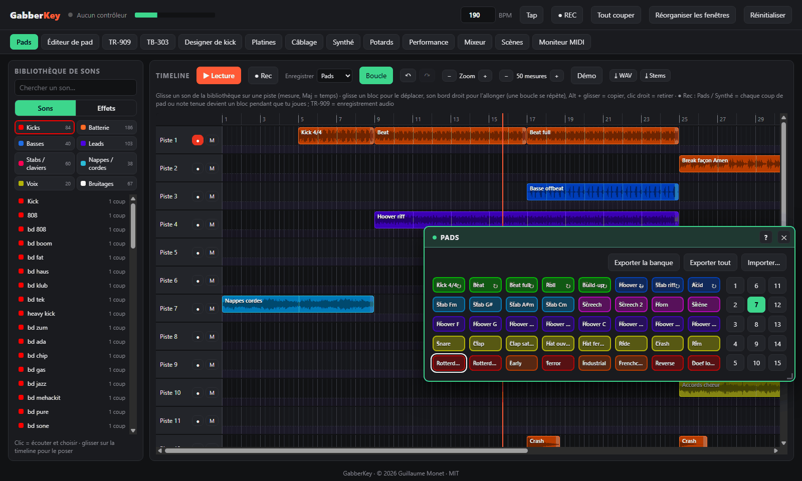
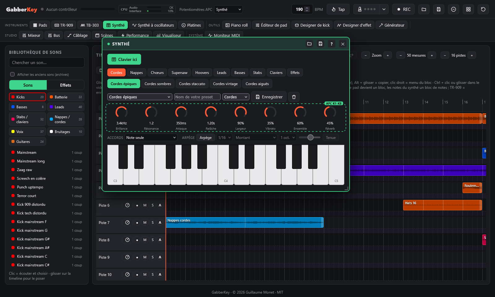
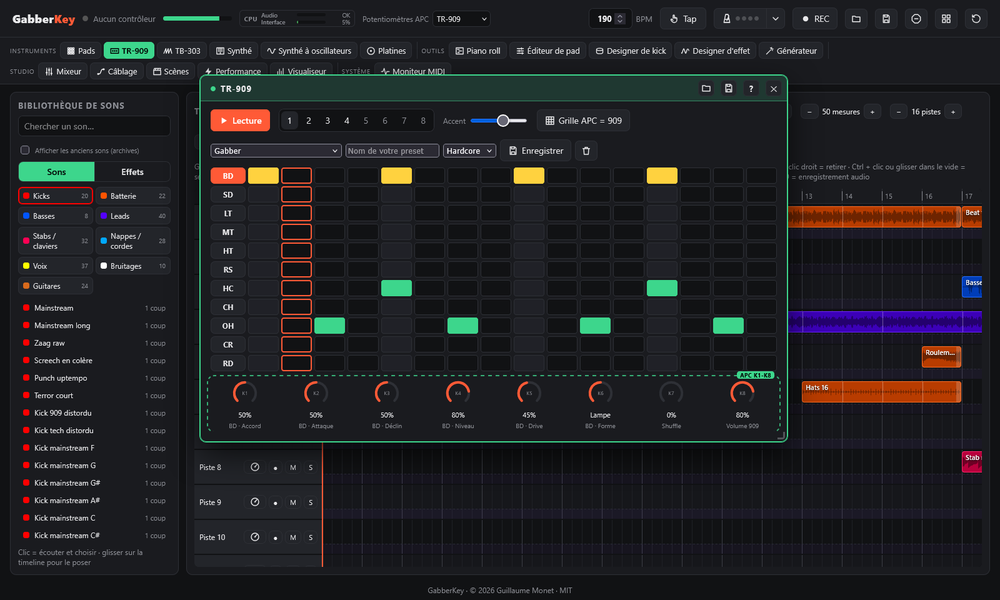
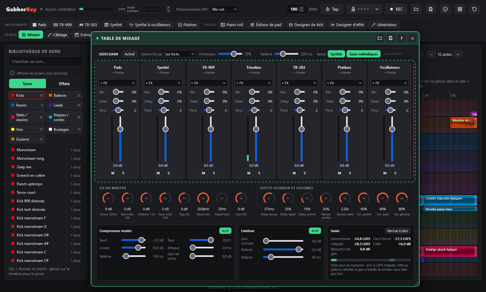

# GabberKey

**Un logiciel de musique hardcore / gabber joué avec un Akai APC Key 25, dans le navigateur.**

*Par Guillaume Monet* · [English version](README.md) · <sub>[☕ Soutenir le projet](https://paypal.me/holythunderblade)</sub>



GabberKey s'organise autour d'une **timeline** : on glisse des sons d'une bibliothèque rangée par catégorie sur des pistes, les blocs se calent à la mesure et tout joue au même tempo. Les autres outils (pads du sampler, TR-909, synthé, table de mixage, effets…) sont des **plugins** qui s'ouvrent dans des fenêtres, et l'Akai APC Key 25 (mk1 ou mk2) les joue en direct. Rien à installer à part un navigateur :

- **Timeline** : 16 pistes en mesures ; glisser, allonger (les boucles se répètent), copier et déplacer des blocs ; joue les pads ou le clavier pendant l'enregistrement et chaque coup ou note tenue devient un bloc, en direct ; la TR-909 s'enregistre en audio.
- **Bibliothèque de sons** : 438 sons rangés en Kicks, Batterie, Basses, Leads, Stabs / claviers, Nappes / cordes, Voix et Effets, plus tes propres sons et tes enregistrements ; un clic pour écouter, glisser pour poser.
  - six **banques hardcore / gabber synthétisées** : kicks Rotterdam et terror distordus, hoovers, stabs rave, screeches, basses hardcore, cordes dramatiques, pianos rave oldschool, breakbeats, kicks et leads mainstream sombres, kicks uptempo modernes à queue brute, supersaws, cris, effets et boucles à 190 BPM ;
  - cinq banques d'échantillons **libres de droits (CC0)**.
- **Plugins** dans des fenêtres déplaçables et aimantées :
  - **Sampler 40 pads** avec 15 banques, des LEDs synchronisées avec l'écran, et le glisser-déposer de tes propres sons ;
  - **Émulation TR-909** : les 11 instruments synthétisés en direct, **distorsion par instrument (drive + 5 formes)**, séquenceur 16 pas et 8 patterns ;
  - **Synthé en couches** au clavier : 35 presets en 10 familles (cordes, nappes, chœurs, supersaw, hoovers, leads, basses, stabs, claviers, effets) avec ensemble, largeur stéréo, vibrato et 8 potards d'expression, mode accords et arpégiateur calé sur le tempo ;
  - **Table de mixage** : une voie par outil avec panoramique, envois delay et reverb, muet / solo, vumètres, jusqu'à 4 effets d'insert, et un **sidechain** déclenché par les kicks ;
  - **Effets de performance** (rolls, balayages de filtre, tape-stop, pump), **égaliseur général**, **scènes** rappelées à la mesure suivante, **moniteur MIDI**.
- **Enregistrement WAV** de ta session et **export / import de kits**.
- Interface en **français ou en anglais**, selon la langue du navigateur.

> 🚧 **GabberKey est en constante évolution.** De nouvelles fonctions arrivent régulièrement, et plein d'autres sont en route : une émulation de **basse acid façon 303**, des **platines** (vinyles à scratcher et à mixer)… et bien plus encore. Mets une étoile ou suis le dépôt pour voir ce qui arrive (voir la [feuille de route](#feuille-de-route)) !

---

## Captures d'écran

| Synthé et générateur de nappes | TR-909 | Table de mixage et sidechain |
|---|---|---|
| [](docs/screenshots/synth-fr.png) | [](docs/screenshots/tr-fr.png) | [](docs/screenshots/mixer-fr.png) |

## Prérequis

- Un **Akai APC Key 25**, mk1 ou mk2. Il est facultatif : tout marche aussi à la souris et au clavier de l'ordinateur.
- **Google Chrome**, **Microsoft Edge** ou **Firefox** (version 108 ou plus). Safari ne gère pas le Web MIDI.
- **Python 3**, uniquement pour servir la page en local (le Web MIDI exige `localhost` ou HTTPS).

## Installation

```bash
git clone https://github.com/guillaumemonet/gabber-apckey25.git
cd gabber-apckey25
```

Ou télécharge le ZIP depuis GitHub et décompresse-le.

## Lancement

1. Branche l'APC Key 25.
2. Lance le serveur local :
   - **Windows** : double-clic sur `start.bat`.
   - **macOS / Linux** : `./start.sh`.
   - **Partout** : `python tools/serve.py`, puis ouvre http://localhost:8025.
3. Dans le navigateur, clique sur **Démarrer**, puis **autorise les appareils MIDI** quand le navigateur le demande.

L'en-tête affiche **APC Key 25 (mk1)** ou **APC Key 25 mk2** avec un point vert quand le contrôleur est détecté.

## Commandes sur l'APC

| Contrôle | Action |
|---|---|
| **Pads** | Jouer le son (le dernier pad frappé devient le pad sélectionné) |
| **Maj + pad** | Sélectionner un pad sans le jouer |
| **SCENE LAUNCH 1-5** | Banques 1-5 · **Maj +** SCENE LAUNCH = banques 6-10, une deuxième fois = banques 11-15 (la LED clignote pour les banques 6 à 15 ; l'écran affiche le numéro de la banque) |
| **Boutons de piste 1 / 2 / 3 / 4** | Page des potards : Synthé / Effets / Pad sélectionné / EQ |
| **Boutons de piste 5 / 6 / 7 / 8** (maintenus) | Roll 1/8 · Roll 1/16 · Roll 1/32 · Filtre ↓ |
| **Maj + piste 5 / 6 / 7 / 8** | Roll 1/4 · Tape-stop · Filtre ↑ · Pump (marche/arrêt) |
| **Maj + piste 1 / 2 / 3 / 4** | Page de potards du mixeur : volumes / panos / envois delay / envois reverb (K1 Pads, K2 Synthé, K3 TR-909, K4 Timeline, K8 master) |
| **Potards K1-K8** | Paramètres de la page active (Maj = réglage fin) |
| **SUSTAIN** | Ouvre / ferme la page EQ (maintenu : EQ le temps de l'appui) |
| **Maj + touche blanche** | Preset de la famille du synthé (do = 1er, ré = 2e…) · **Maj + do# / ré#** = famille précédente / suivante · **Maj + fa# / sol# / la#** = type d'accord / arpège oui-non / vitesse de l'arpège |
| **Clavier** | Joue le synthé |
| **PLAY** | Lancer / arrêter la timeline (la TR-909 a son propre ▶ dans sa fenêtre) |
| **Maj + PLAY** | Transformer la grille de pads en TR-909 (et revenir) |
| **REC** | Enregistrer l'outil choisi dans la piste armée de la timeline (et arrêter) |
| **STOP ALL CLIPS** | Coupe tout |
| **Maj + STOP ALL CLIPS** | Transformer la grille de pads en 40 scènes (et revenir) |

**LEDs** : un pad chargé prend sa couleur, et un son en cours est allumé à fond ou clignote. Le mk1 n'a que trois couleurs (rouge, vert, jaune), donc le sélecteur de couleur n'affiche que celles-là quand un mk1 est branché.

Tout se fait aussi à la souris. Sur le clavier de l'ordinateur, la rangée du milieu joue des notes (Q S D F… en AZERTY) et **W / X** changent d'octave.

## Banques

| Banque | Contenu |
|---|---|
| 1 | Kit de départ, synthétisé dans le navigateur |
| 2 | Batterie |
| 3 | Électro |
| 4 | Boucles (22 boucles à 120 BPM) |
| 5 | Textures et basses |
| 6 | Tabla et divers |
| 7 | **Gabber** : 8 kicks (Rotterdam, Early, Terror, Industrial, Frenchcore, Reverse…), percussions, hoovers, stabs, screeches, boucles à 190 BPM |
| 8 | **Gabber 2** : kicks accordés de do à sol, effets (montée, descente, laser, impact…), 16 boucles, stabs rave |
| 9 | **Hardcore** : kicks plus durs (terror, uptempo, speedcore, industrial, mainstream…), basses distordues, accords de cordes (Fm, Db, Eb, Cm, Bbm, Ab), staccato et coup d'orchestre, boucles cordes / basse (ostinato, progression, offbeat, roulante, reese, morceau complet de 4 mesures) et boucles de batterie hardcore, le tout à 190 BPM |
| 10 | **Oldschool** (rave / hardcore début 90) : kicks 909 et 808, kit de breakbeat, pianos rave (Fm, Db, Eb, Cm, Bbm, Ab), stabs Mentasm et belge, chœur « ahh », vox stab, sifflet, sirène d'alerte, break façon Amen et break découpé, riff de piano, arpège rave, morceau oldschool de 4 mesures, le tout à 190 BPM |
| 11 | **Mainstream** (hardcore mainstream sombre, fa mineur harmonique) : kicks à queue tonale distordue (rageur, sombre, punchy, chute de hauteur, brut, accordés do# et sol#), clap dur et percussions, leads sombres et hurlants, screeches, hoover sombre, cloches « horreur », piano sombre, cris synthétisés (« hey », « oi », « yeah »), chœur et cordes sombres, nappe « horreur », boucles (beat, riff de lead, riff de screech, mélodie de cloches, nappe de breakdown, montée, morceau complet de 4 mesures), le tout à 190 BPM |
| 12 | **New wave** (hardcore moderne / uptempo) : kicks à longue queue « zaag » (zaag, brut, screech kick, attaque dure, tok, kick-basse), 8 kicks accordés (de fa à fa) pour les mélodies de kicks, lead et accords supersaw (Fm, Db, Ab, Eb), pluck, lead glissé, nappe euphorique, cris, montées, tunnel, bégaiement, boucles (beat uptempo, kick-basse, mélodie de kicks, galop, accords supersaw, mélodie pluck, montée, drop de 4 mesures), le tout à 190 BPM |

Pour charger ton propre son, glisse un fichier audio (WAV, MP3, FLAC, OGG…) sur un pad ou sur l'éditeur, ou utilise **Charger un son…**. Le **crayon ✎**, qui apparaît au survol d'un pad, ouvre l'**éditeur de pad** sur ce pad : nom, couleur de la LED, mode de lecture (**One-shot**, **Maintien** ou **Boucle**) et les **8 potards** du pad (volume, hauteur, panoramique, filtre, début, delay, reverb, mode), aussi sur les potards de l'APC.

## TR-909

Une émulation de la Roland TR-909 avec ses 11 instruments : grosse caisse, caisse claire, 3 toms, rim shot, clap, charley fermé et ouvert, crash, ride. Chacun est synthétisé en direct, comme les circuits analogiques de la machine d'origine.

**Potentiomètres** (page TR-909 du plugin Potards, aussi ouverte par Maj + PLAY) :

| K1-K4 | K5 | K6 | K7 | K8 |
|---|---|---|---|---|
| Paramètres de l'instrument choisi (ex. BD : Accord, Attaque, Déclin, Niveau) | **Drive** : quantité de distorsion | **Forme** : Douce, Dure, Lampe, Repli (wavefolder), Crush (réduction de bits) | Shuffle | Volume 909 |

Chaque instrument a sa propre distorsion. La grosse caisse démarre avec une saturation « Lampe », pour le son gabber. La quantité d'accent se règle avec le curseur à l'écran.

**Séquenceur** : 16 pas et 8 patterns, dont 4 préréglés (gabber, rave, breakbeat, roulement de grosse caisse). Il suit le même tempo et la même grille de mesures que les boucles, donc il reste calé avec elles. Un changement de pattern attend la mesure suivante. À l'écran, un clic sur un pas fait défiler note → accent → silence, et un clic sur le nom d'un instrument le joue et le sélectionne.

**Grille de l'APC en mode 909** (Maj + PLAY) :

| Rangée | Pads |
|---|---|
| 1-2 | Les 16 pas de l'instrument choisi (rouge = tête de lecture, vert = note, jaune = accent) |
| 3 | BD, SD, LT, MT, HT, RS, HC, CH : jouer et sélectionner |
| 4 | OH, CR, RD, puis **Accent** (les pas posés sont accentués), **Effacer** (vide l'instrument), **Muet** |
| 5 | Patterns 1 à 8 |

Un appui sur un bouton SCENE LAUNCH ramène la grille aux pads du sampler.

## Démo

Clique sur **Démo** dans la barre de la timeline pour charger le morceau de démonstration : environ une minute à 190 BPM en fa mineur, construit avec les banques Gabber, Hardcore et Oldschool (intro aux cordes, montée gabber avec hoovers, premier drop, break oldschool avec break façon Amen, piano et chœurs, second drop hardcore avec screech et cordes, final en roulement de kicks). Appuie sur ▶ pour l'écouter, puis modifie-le comme tu veux. Tu peux aussi l'écouter directement : [`demo/gabberkey-demo.ogg`](demo/gabberkey-demo.ogg) (rendu par `tools/render_demo.py` à partir de `demo/demo.json`).

## Timeline et bibliothèque de sons

L'écran principal : la **bibliothèque de sons** à gauche, la **timeline** à droite (16 pistes, 32 mesures au départ, − / + pour changer la longueur, zoom, **Boucle**).

- **Bibliothèque** : choisis une catégorie (Kicks, Batterie, Basses, Leads, Stabs / claviers, Nappes / cordes, Voix, Effets, Mes sons, Enregistrements) ou cherche par nom. Un **clic** sur un son l'écoute (et le choisit) ; l'étiquette indique sa longueur en mesures (boucles) ou « 1 coup ».
- **Poser** : glisse un son sur une piste. Il se cale au début de la mesure (garde **Maj** enfoncée pour le poser sur un temps). Un clic dans une case vide pose le dernier son choisi.
- **Modifier les blocs** : glisse un bloc pour le déplacer (vers une autre mesure ou une autre piste), tire son **bord droit** pour l'allonger ou le raccourcir (une boucle se répète pour remplir le bloc), **Alt + glisser** le copie, un **double-clic** l'écoute, un **clic droit** ou **Suppr** le retire. Chaque piste a un bouton muet.
- **Enregistrer en jouant** : choisis ce qu'on enregistre, arme une piste (●), place la tête de lecture (clic sur la règle), puis **● Rec** (ou REC sur l'APC). La timeline joue (en boucle si Boucle est activé) et :
  - **Pads** : chaque coup de pad devient un bloc de ce pad, là où tu l'as frappé (calé à la double-croche). Le bloc rejoue le pad avec ses réglages.
  - **Synthé** : chaque note devient un bloc de note qui **s'allonge tant que tu tiens la touche** ; il rejoue avec le preset du synthé en cours.
  - Les blocs apparaissent en direct pendant que tu joues. Si la piste armée est occupée à ce moment-là, le bloc va sur la piste libre suivante. Avec Boucle, tu peux ajouter des coups à chaque passage.
  - **TR-909** : la 909 démarre calée sur les mesures de la timeline et s'enregistre en audio dans un bloc (aussi rangé dans la bibliothèque, rubrique Enregistrements).
  - **■ Arrêter rec** (ou REC à nouveau) termine l'enregistrement.
- **Lire** : ▶ (ou PLAY sur l'APC) joue depuis la tête de lecture ; la vue suit la tête de lecture. Les boucles faites à un autre tempo suivent le tempo global. La timeline a sa propre voie dans la table de mixage.

## Scènes

40 scènes disposées comme la grille de l'APC (1-8 en bas). Une scène mémorise :
- les boucles lancées ;
- le pattern de la TR-909 et ses instruments muets ;
- les niveaux, panoramiques, envois, muets et solos de la table de mixage ;
- le preset du synthé, le tempo, et l'état lecture ou arrêt.

- **Lancer** : clic sur une scène. Tout bascule **à la mesure suivante** : les nouvelles boucles démarrent, les autres s'arrêtent, les patterns changent et le mixeur suit.
- **Enregistrer** l'état actuel : Maj + clic, ou active le **Mode enregistrement**. Un clic droit efface une scène.
- **APC** : **Maj + STOP ALL CLIPS** transforme la grille de pads en 40 scènes. Pad = lancer, Maj + pad = enregistrer, Maj + STOP ALL CLIPS à nouveau (ou un bouton SCENE LAUNCH) pour revenir. LEDs : vert = enregistrée, rouge = en cours, clignotant = en attente de la mesure suivante.

## Table de mixage

Une voie par outil : **Pads**, **Synthé**, **TR-909** et **Timeline**, puis le master (effets de performance, égaliseur général et limiteur). Le niveau de chaque son reste dans son outil (volume des pads, niveaux des instruments de la 909) ; la table de mixage équilibre les outils entre eux.

Chaque voie a des effets d'insert (**+ FX**, jusqu'à 4, appliqués dans l'ordre), des envois reverb et delay, un panoramique, un fader (0 dB aux trois quarts), **M**uet, **S**olo et un vumètre. Effets disponibles :
- **Distorsion** : drive et les 5 formes de la 909.
- **Filtre** : passe-bas ou passe-haut, coupure et résonance.
- **Compresseur** : seuil, ratio et gain.
- **Reverb** : taille et dosage.

Double-clic sur un réglage pour le remettre à zéro. Sur l'APC, **Maj + bouton de piste 1 / 2 / 3 / 4** transforme les potards en volumes / panoramiques / envois delay / envois reverb du mixeur : K1 = Pads, K2 = Synthé, K3 = TR-909, K4 = Timeline, K8 = volume général. Les réglages du mixeur sont sauvegardés et inclus dans les exports de session.

### Sidechain

En haut de la fenêtre de la table de mixage. Quand il est **Activé**, chaque kick fait baisser le **synthé** (clavier, blocs de notes et d'accords) et les **sons mélodiques** (pads et blocs de la timeline des catégories Basses, Leads, Stabs / claviers, Nappes / cordes et Voix), qui remontent ensuite en douceur : le morceau respire avec le kick. Les kicks et la batterie ne sont jamais baissés.

- **Déclenché par** :
  - **Les kicks** : la grosse caisse de la TR-909, les pads et blocs de kick, et les kicks des boucles de GabberKey (leur position exacte est enregistrée dans la bibliothèque : un galop, un roulement ou une montée baisse le son sur chacun de ses kicks). Un enregistrement de la 909 dans la timeline garde aussi la position de ses kicks.
  - **Chaque temps** : sur chaque temps de la grille, pour les boucles dont on ne connaît pas les kicks (boucles Sonic Pi, tes propres boucles).
- **Profondeur** (de combien le son baisse) et **Relâche** (le temps qu'il met à remonter) ; double-clic pour revenir à la valeur par défaut.
- **Baisse** : choisis le synthé, les sons mélodiques, ou les deux. Le témoin montre la baisse en temps réel.
- La baisse est programmée à l'instant exact de chaque kick (sur l'horloge audio), et non détectée après coup : aucun retard, et elle reste calée à n'importe quel tempo.

## Fenêtres des plugins

La barre sous l'en-tête ouvre et ferme les plugins : **Pads**, **Éditeur de pad**, **TR-909**, **Synthé** (clavier et presets), **Potards**, **Performance**, **Mixeur**, **Scènes** et **Moniteur MIDI**. Chacun s'ouvre dans une fenêtre au-dessus de la timeline :
- Chaque fenêtre a une barre de titre : le **titre** à gauche, **?** et **✕** à droite.
- **Déplace**-la par sa barre de titre, **redimensionne**-la par son coin en bas à droite ; elle **s'aimante** aux bords de l'écran et aux autres fenêtres.
- **?** ouvre l'**aide** du contenu de la fenêtre, à côté d'elle (**?** à nouveau, ✕ ou Échap la ferme).
- **✕** la ferme ; les fenêtres utilisées sont mémorisées avec leur position.
- **Réorganiser les fenêtres** (en-tête) les remet à leur place et à leur taille de départ.

## Synthé

Le clavier joue un synthé en couches pensé pour le hardcore : chaque preset empile jusqu'à 3 **couches** d'oscillateurs (scie, carré, triangle, sinus ou impulsion, chacune avec son unisson, son octave et son niveau), avec des **formants** (résonance de caisse des cordes, voyelles « a » / « o » des chœurs), un **ensemble** stéréo, l'unisson étalé dans la stéréo, et un vibrato qui arrive après un instant.

**35 presets en 10 familles** (fenêtre Synthé, ou **Maj + touche blanche** sur l'APC = preset de la famille, **Maj + do# / ré#** = famille précédente / suivante) :

| Famille | Presets |
|---|---|
| Cordes | Épiques, Sombres, Staccato, Vintage, Aiguës |
| Nappes | Thunderdome, Sombre, Chaude, De verre, Balayée |
| Chœurs | Rave, « Ooh », Sombre |
| Supersaw | Uplifting, Lead hardstyle, Nappe, Stab |
| Hoovers | Hoover, Mentasm |
| Leads | Init, Acid 303, Screech, Horn, Lead gabber |
| Basses | Distordue, Reese, Sub |
| Stabs | Rave, Belge, Coup d'orchestre |
| Claviers | Piano rave, Orgue |
| Effets | Kick accordé, Sirène, Laser |

**8 potards d'expression**, adaptés à la famille (dans la fenêtre Synthé et sur la page Synthé de l'APC) :
- cordes, nappes, chœurs, supersaw, stabs, claviers : Brillance, Résonance, Attaque, Relâche, **Largeur**, **Vibrato**, **Ensemble**, Réverb ;
- hoovers, leads, basses, effets : Brillance, Résonance, Attaque, Relâche, Saturation, **Glissé**, Désaccord, Réverb.

Double-clic sur un potard de la fenêtre Synthé pour revenir à la valeur du preset.

### Accords et arpégiateur

Sous les potards de la fenêtre Synthé :
- **Accords** : une touche joue un accord complet : mineur, majeur, sus2, sus4, mineur 7, quinte ou octave. **Dans la tonalité (fa mineur)** construit sur chaque touche l'accord juste de la gamme (fa → fa m, sol# → lab, do# → réb, ré# → mib…), pour rester accordé avec les banques.
- **Arpège** : les notes tenues (ou l'accord) sont jouées l'une après l'autre, calées sur le tempo et sur la même grille que les boucles. Vitesse 1/8, 1/16 ou 1/32 ; ordre montant, descendant, montant-descendant, aléatoire ou joué ; étendue de 1 à 3 octaves ; durée des notes ; **Tenue** garde l'arpège quand on lâche les touches (la touche suivante en commence un nouveau).
- Sur l'APC : **Maj + fa#** = type d'accord suivant, **Maj + sol#** = arpège oui / non, **Maj + la#** = vitesse de l'arpège.

Quand la timeline enregistre le synthé, les accords et chaque note de l'arpège deviennent des blocs.

### Générateur de nappes

**Générateur de nappes → timeline**, dans la fenêtre Synthé, ouvre le générateur : il pose des blocs de cordes ou de nappes sur la timeline à partir d'une suite d'accords.

- **Suite d'accords** : tape les accords séparés par des espaces ou des tirets (`Fm Db Eb Cm`, `Fm-Bbm-Db-C`…), ou clique sur une suite toute prête. Reconnus : majeur (`Db`), mineur (`Fm`), `7`, `m7`, `maj7`, `sus2`, `sus4`, `dim`, `aug`, `5`, `add9`, avec `#` / `b`.
- **Son** : le preset du synthé en cours, ou un preset parmi les familles cordes, nappes, chœurs, supersaw, stabs ou claviers. Chaque bloc garde **son propre preset** : tu peux jouer autre chose au clavier, ou changer de preset, sans changer les nappes.
- **Registre** (grave, médium, aigu), **mesures par accord** (1, 2 ou 4), **répétitions** (×1, ×2, ×4), **rythme** (tenu, chaque temps, contretemps, croches).
- **Basse** : aucune, sub (tenue), hardcore en contretemps ou reese (tenue), sur la fondamentale de chaque accord, sur une deuxième piste.
- Les accords s'enchaînent en douceur : les notes communes sont gardées et les autres bougent le moins possible.
- **▶ Écouter** joue le premier accord ; **Générer** pose les blocs à partir de la mesure de la tête de lecture, sur la première piste libre sur toute la durée, en partant de la piste armée. La timeline s'allonge si besoin.

Un bloc d'accord se manipule comme les autres : le déplacer, l'allonger, le copier (Alt), l'écouter (double-clic) ou le supprimer.

## Tempo et boucles

Le tempo global (en-tête, ou bouton **Tap**) pilote toutes les boucles. Chacune démarre sur la mesure suivante et reste calée quand tu changes le tempo. Pour tes propres boucles, indique leur tempo d'origine dans l'éditeur, ou clique sur **Auto** : le calcul suppose que le fichier dure un nombre entier de mesures. Règle le tempo à 190 pour les banques Gabber, Hardcore, Oldschool, Mainstream et New wave : leurs boucles partagent la même tonalité (fa mineur) et les mêmes longueurs, elles restent donc calées entre elles.

## Pages des potentiomètres

- **Synthé** : les 8 potards d'expression de la famille du synthé (voir Synthé)
- **Effets** : temps, répétitions et envoi du delay, envoi et taille de la reverb, saturation, volume des pads, volume général
- **Pad** : volume, hauteur, panoramique, filtre, point de départ, envois delay et reverb, et mode de lecture du pad sélectionné
- **EQ** : grave 100 Hz, bas-médium 350 Hz, médium 1,2 kHz, haut-médium 3,5 kHz, aigu 9 kHz (±15 dB), passe-bas, passe-haut, gain de sortie

Double-clic sur un potard à l'écran pour le remettre à zéro.

## Effets de performance

- **Rolls** (répétition) calés sur la grille : la répétition démarre sur la double-croche suivante.
- **Filtre ↓ / ↑** balaie un passe-bas ou un passe-haut sur une mesure tant que tu maintiens.
- **Tape-stop** ralentit tout jusqu'à l'arrêt.
- **Pump** fait s'effacer le synthé à chaque temps.

## Enregistrement et kits

- **● REC** dans l'en-tête enregistre la sortie générale. Un second appui télécharge un fichier WAV.
- **Exporter la banque** / **Exporter tout** crée un fichier `.apckit` autonome, avec les sons et les réglages. **Importer…** le recharge : une banque va dans la banque affichée, une session remplace tout.

Tes banques, tes sons et tes réglages sont sauvegardés automatiquement dans le navigateur.

## Langue

L'interface suit la langue du navigateur : français si le navigateur est en français, anglais sinon. Pour forcer une langue, ajoute `?lang=fr` ou `?lang=en` à l'adresse.

## Feuille de route

Ce qui arrive ensuite, dans cet ordre :

1. **Annuler / rétablir** dans la timeline, et un **export WAV rapide** du morceau (calculé en quelques secondes, avec aussi les pistes séparées / stems).
2. **Basse acid façon TB-303** : séquenceur de 16 pas avec slide et accent, cutoff, résonance, enveloppe et distorsion.
3. **Designer de kick** : fabrique ton propre kick gabber (attaque, hauteur et chute de la queue, queue brute « zaag », distorsion, formant) et envoie-le sur un pad ou dans la bibliothèque.
4. **Platines** : deux decks avec pitch, sync, cue, crossfader et scratch.

Les idées et suggestions sont les bienvenues dans les [issues](https://github.com/guillaumemonet/gabber-apckey25/issues).

## Compatibilité matérielle

GabberKey est développé et testé avec un **Akai APC Key 25 mk1**. Le **mk2** est pris en charge d'après la documentation MIDI d'Akai Professional, mais n'a pas encore été essayé sur un vrai appareil. Tout fonctionne aussi à la souris et au clavier de l'ordinateur.

> **Un mot pour Akai Professional** 🙏
>
> Chère équipe Akai, merci de concevoir des contrôleurs aussi inspirants : GabberKey existe parce que l'APC Key 25 est un vrai plaisir à jouer. Si vous aviez un jour la grande gentillesse de prêter ou d'envoyer un peu de votre matériel (un APC Key 25 mk2, un APC mini mk2, un APC64, un MPK mini…), je serais vraiment ravi de rendre GabberKey le plus compatible possible avec lui, et de partager librement le résultat avec toutes celles et ceux qui jouent sur vos instruments. N'hésitez surtout pas à me contacter en [ouvrant une issue](https://github.com/guillaumemonet/gabber-apckey25/issues) sur ce dépôt. Merci infiniment pour votre temps et votre bienveillance !

## Dépannage

| Symptôme | Solution |
|---|---|
| « Accès MIDI refusé » | Clique sur l'icône à gauche de l'adresse → Appareils MIDI → Autoriser, puis recharge. |
| « Port inaccessible » | Un autre logiciel (Ableton, FL Studio…) utilise l'APC. Sous Windows, un port MIDI ne se partage pas : ferme ce logiciel et recharge. |
| Détecté mais les pads ne font rien | Débranche l'APC, attends 10 secondes, rebranche-le sur un autre port USB, puis recharge. Le service MIDI de Windows peut cesser de transmettre après une mise en veille ou un branchement à chaud. |
| Pas de son | Clique d'abord sur **Démarrer** : les navigateurs bloquent le son avant un clic. |
| Une nouvelle banque de sons n'apparaît pas | Relance `start.bat` / `start.sh`, puis recharge. Une nouvelle banque de la bibliothèque va dans sa banque prévue si elle est vide, sinon dans la première banque vide (un message indique laquelle). |
| Voir ce qu'envoie l'APC | Ouvre le plugin **Moniteur MIDI**. |

## Régénérer les banques de sons (facultatif)

Le dossier `sounds/` est déjà fourni. Pour le régénérer, par exemple à un autre tempo :

```bash
python -m venv tools/.venv
tools/.venv/Scripts/pip install -r tools/requirements.txt    # Windows
# tools/.venv/bin/pip install -r tools/requirements.txt      # macOS / Linux
tools/.venv/Scripts/python tools/build_banks.py --bpm 128 --gabber-bpm 200
```

Le script travaille en deux temps :
- **Échantillons CC0** : il télécharge les échantillons de Sonic Pi, retire le silence initial et normalise le volume. Pour les boucles, il détecte le tempo, étire le son au tempo cible sans changer la hauteur (WSOLA) et coupe chaque boucle à un nombre exact de mesures.
- **Banques Gabber, Hardcore, Oldschool, Mainstream et New wave** : il les synthétise de zéro (`tools/gabber.py`).

Clique ensuite sur **Réinitialiser** dans l'appli.

## Structure du projet

```
index.html            page
css/style.css         styles
js/main.js            interface et liaisons
js/apc.js             détection de l'APC Key 25, lecture MIDI, LEDs (mk1 + mk2)
js/audio.js           moteur audio : synthé, sampler, effets, EQ, tempo
js/tr909.js           émulation TR-909 et séquenceur
js/timeline.js        timeline : pistes, blocs, lecture
js/mixer.js           table de mixage : voies, envois, effets d'insert
js/sidechain.js       sidechain (les kicks font baisser le synthé et les sons mélodiques)
js/library.js         bibliothèque de sons (catégories)
js/windows.js         fenêtres des plugins
js/help.js            aide de chaque fenêtre (bouton ?)
js/presets.js         presets du synthé
js/performer.js       mode accords et arpégiateur
js/chords.js          suites d'accords (générateur de nappes)
js/params.js          paramètres des potards
js/i18n.js            traductions anglais / français
js/kit.js             kit de départ (synthétisé)
js/kits.js            export / import de kits
js/recorder*.js       enregistrement WAV
js/storage.js         sauvegarde locale (IndexedDB)
tools/serve.py        serveur web local (sans cache)
tools/build_banks.py  construction des banques de sons
tools/gabber.py       synthèse des sons gabber
sounds/               banques générées + banks.json
```

## Crédits

- Conception et développement : **Guillaume Monet**
- Banques 2 à 6 : échantillons de [Sonic Pi](https://github.com/sonic-pi-net/sonic-pi), domaine public (CC0). Voir `sounds/CREDITS.md`.
- Banques gabber et kit de départ : synthétisés par le code de GabberKey.
- Protocole MIDI de l'APC Key 25 mk2 : documentation Akai Professional.

## Licence

Code publié sous [licence MIT](LICENSE) © 2026 Guillaume Monet. Les échantillons Sonic Pi des banques 2 à 6 restent dans le domaine public (CC0).

Akai Professional, APC et MPK sont des marques d'inMusic Brands, Inc. Roland, TR-909 et TB-303 sont des marques de Roland Corporation. GabberKey est un projet indépendant, sans lien avec ces sociétés ni soutien de leur part.
