# GabberKey

**A complete music studio in your browser, born for hardcore / gabber, played with an Akai APC Key 25.**

*By Guillaume Monet* · [Version française](README.fr.md) · [☕ Support the project](https://paypal.me/holythunderblade)

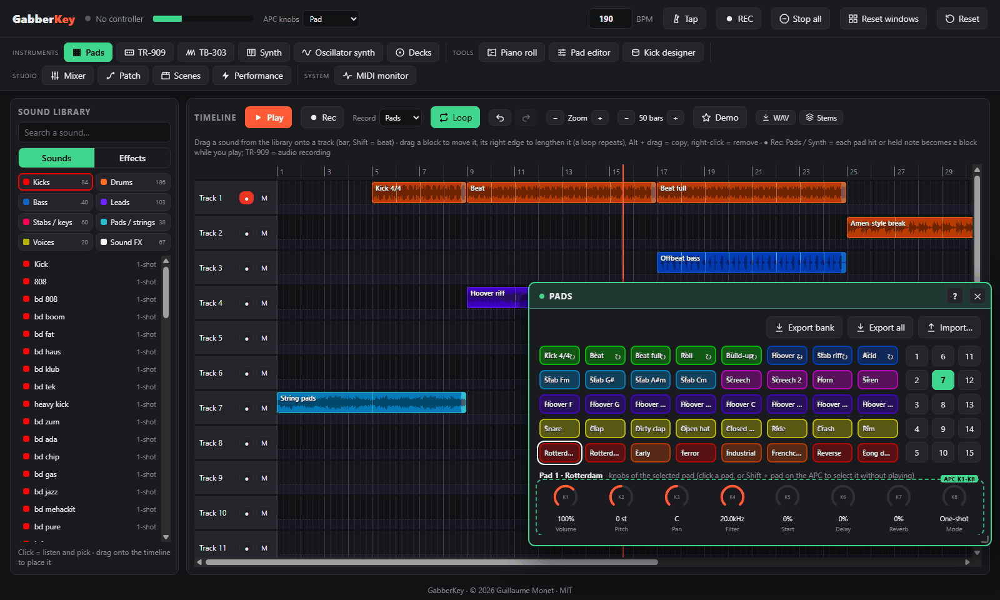

GabberKey is built around a **timeline**: drag sounds from a library sorted by category onto tracks, the blocks snap to the bar and everything plays at the same tempo. The other tools (sampler pads, TR-909, synth, mixer, effects…) are **plugins** that open in windows, and the Akai APC Key 25 (mk1 or mk2) plays them live. Nothing to install except a web browser:

- **Timeline**: 16 tracks to start (up to 64), each with its own knobs (volume, pan, filters, sends); drag, lengthen (loops repeat), copy and move blocks; play the pads or the keyboard while recording and every hit becomes a block, live, and the synth notes one note block; edit the notes in a **piano roll**; record the TR-909 as audio; select several blocks and copy / paste them.
- **Sound library**: 798 sounds sorted into Kicks, Drums, Bass, Leads, Stabs / keys, Pads / strings, Voices, FX and Guitars, starting with the new **Anthem** banks (200 sounds made to build a hardcore anthem, older banks archived), plus your own sounds and recordings; click to listen, drag to place.
  - nine **synthesised hardcore / gabber / hardstyle banks** (no duplicates), including two banks of **80 melodies**: distorted Rotterdam and terror kicks, hoovers, rave stabs, screeches, hardcore basses, dramatic strings, oldschool rave pianos, breakbeats, dark mainstream kicks and leads, modern uptempo kicks with raw tails, supersaws, shouts, FX and loops at 190 BPM;
  - five banks of **public-domain (CC0)** samples.
- **Plugins** in movable, magnetic windows:
  - **40-pad sampler** with 25 banks (a bank's sounds load when you show it, so startup is fast), pad LEDs synced to the screen, and drag & drop of your own sounds;
  - **TR-909 emulation**: the 11 instruments synthesised live, per-instrument **distortion (drive + 5 shapes)**, 16-step sequencer with 8 patterns;
  - **Piano roll**: edit the notes of the synth blocks (pitch, length, velocity, copy / paste, quantize, step input from the APC keyboard);
  - **Kick designer**: build your own distorted kick from 12 knobs and 8 presets, then send it to a pad or the library;
  - **Effect designer**: draw the curve of an effect (volume, filters, pan, saturation, sends) over 1, 2 or 4 beats and put it on any track;
  - **Turntables**: two decks with scratchable records (forwards and backwards), sync, cue, EQ, DJ filter and crossfader;
  - **TB-303-style acid bass line**: 16-step sequencer with accent and slide, resonant filter with envelope, distortion, step entry from the APC keyboard, in sync with the 909;
  - **Oscillator synth**: 3 oscillators with unison, FM, ring modulation, noise, 12 / 24 dB filter, 2 envelopes, tempo-synced LFO, poly / mono / legato, 12 presets and your own;
  - **Layered synth** on the keyboard: 35 presets in 10 families (strings, pads, choirs, supersaw, hoovers, leads, basses, stabs, keys, FX) with ensemble, stereo width, vibrato and 8 expression knobs, chord mode and a tempo-synced arpeggiator;
  - **Mixer**: one channel per tool with pan, delay and reverb sends, mute / solo, meters, up to 4 insert effects, and a **sidechain** triggered by the kicks;
  - **Patch**: wire the tools and **effect boxes** (distortion, PCF, filter, delay, reverb, compressor, bitcrusher) freely, everything in sync with the tempo;
  - **Visualizer** in the Winamp spirit: 21 modes (LED spectrum, oscilloscope, Milk swirls, hi-fi VU meters, text slam, particles, Amiga bars, spectrogram, and 3D / GPU modes: tunnel, synthwave landscape, blob, hyperspace, fractal, lasers, spectrum city, LED wall, metaballs, plasma, rotozoomer, fluid, reaction-diffusion), stackable filters (CRT, kaleidoscope, glitch, strobe), and a projector window for a second screen;
  - **Performance effects** (rolls, filter sweeps, tape stop, pump), **master EQ**, **scenes** recalled on the next bar, **MIDI monitor**.
- **Save and open** the whole project, the song or the settings of each tool (`.gabber` files), **fast WAV export and stems**, **WAV recording** of your session and **kit export / import**.
- Interface in **English or French**, following the browser language.

> 🚧 **GabberKey is constantly evolving.** New features land regularly, and plenty more is on the way: MIDI learn for other controllers, an online version… and much more. Star or watch the repository to follow what's coming (see the [roadmap](#roadmap))!

---

## Screenshots

| | |
|---|---|
| **Sampler pads and pad editor** [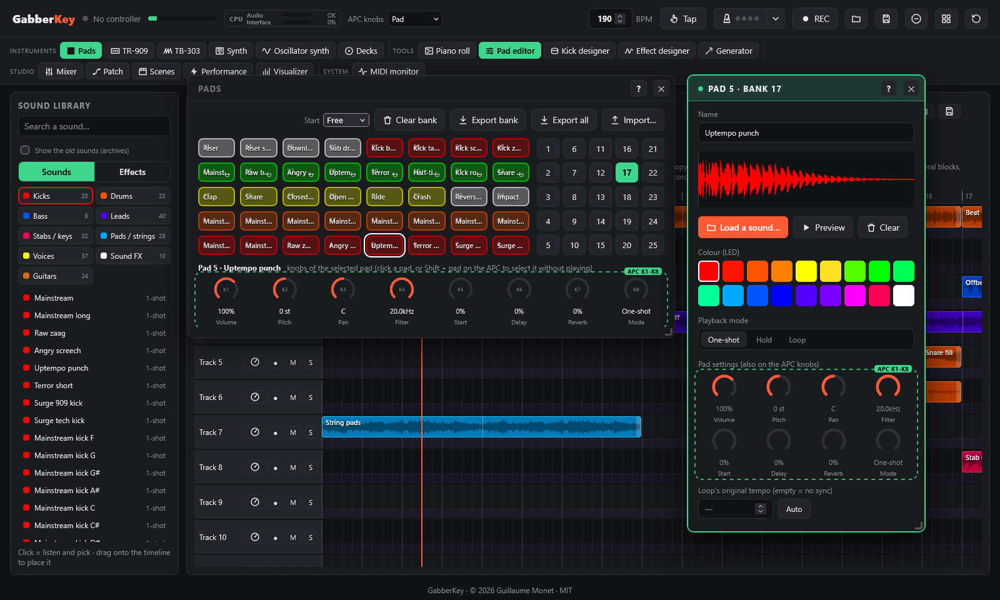](docs/screenshots/pads-en.png) | **Synth** [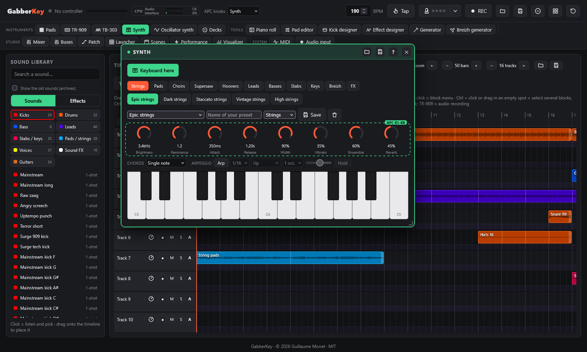](docs/screenshots/synth-en.png) |
| **TR-909** [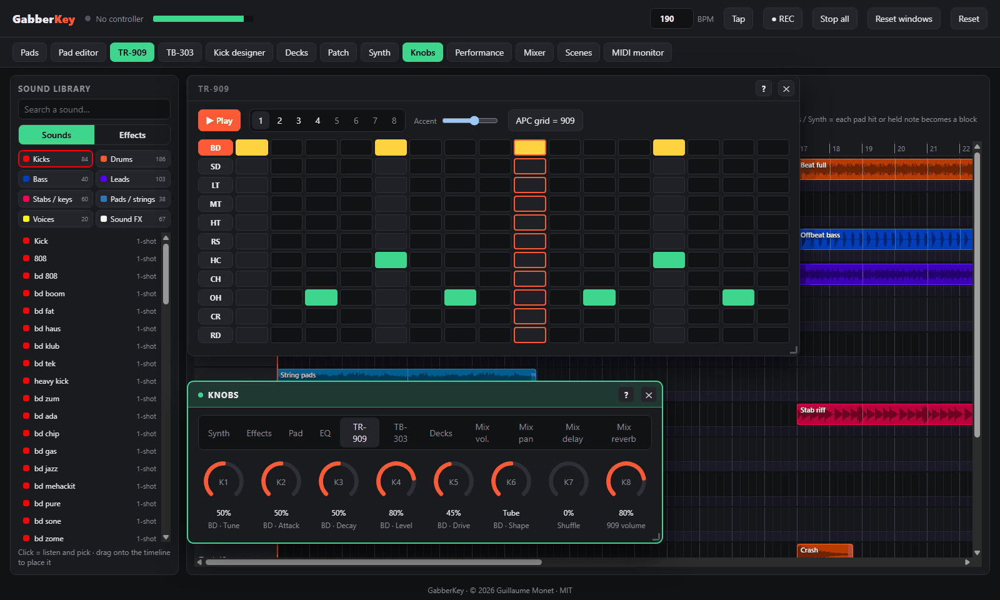](docs/screenshots/tr-en.png) | **TB-303** [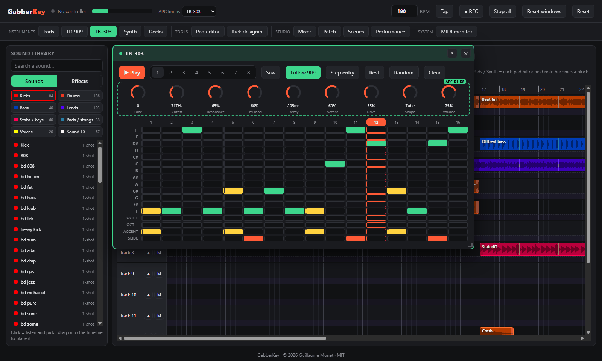](docs/screenshots/acid-en.png) |
| **Kick designer** [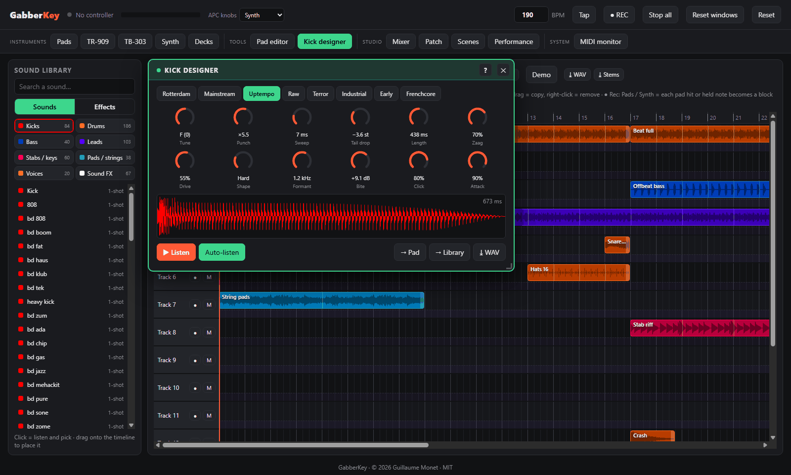](docs/screenshots/kick-en.png) | **Turntables** [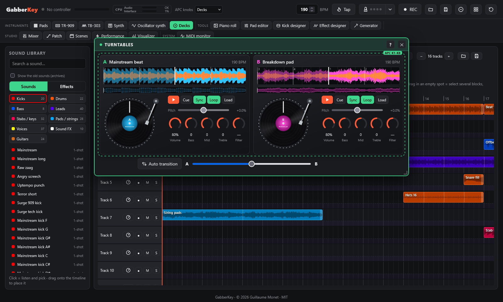](docs/screenshots/decks-en.png) |
| **Mixer and sidechain** [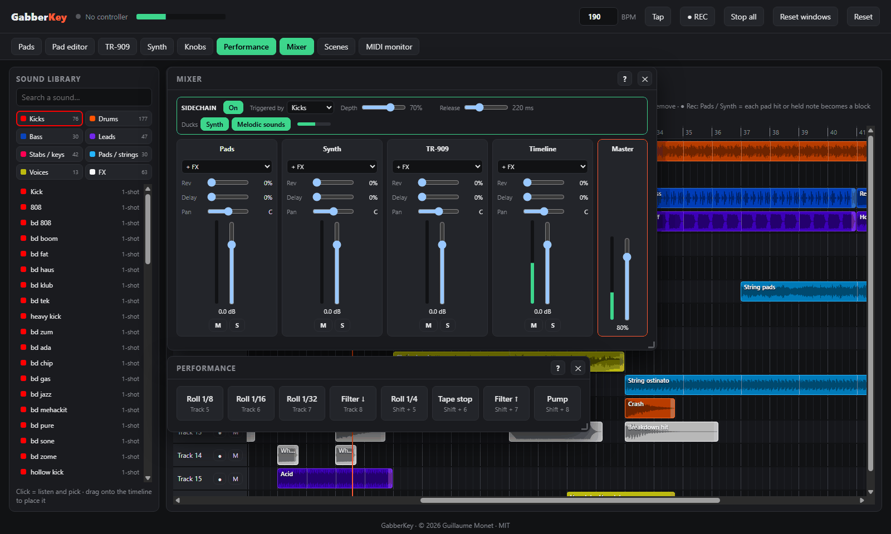](docs/screenshots/mixer-en.png) | **Patch** [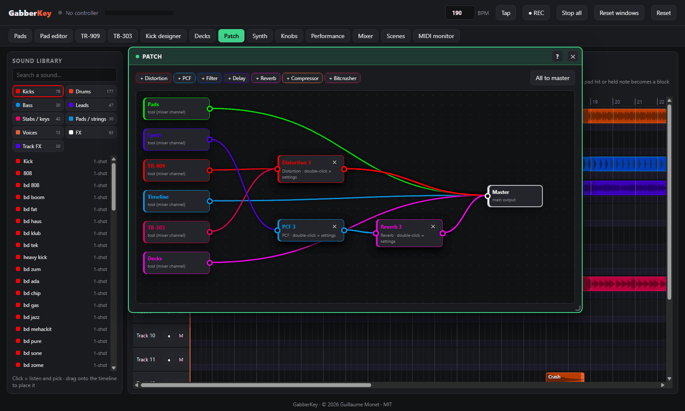](docs/screenshots/patch-en.png) |
| **Track effects** [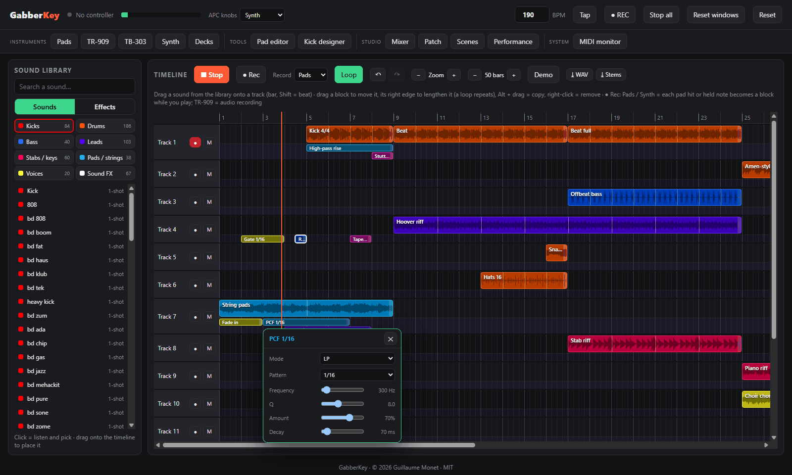](docs/screenshots/tlfx-en.png) | **Scenes and performance** [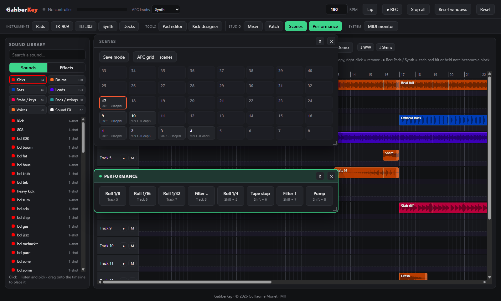](docs/screenshots/scenes-en.png) |
| **Piano roll** [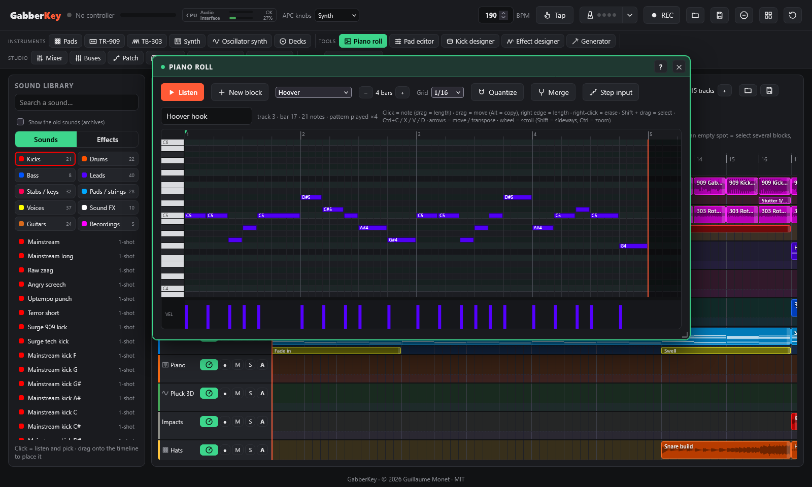](docs/screenshots/roll-en.png) | **Oscillator synth** [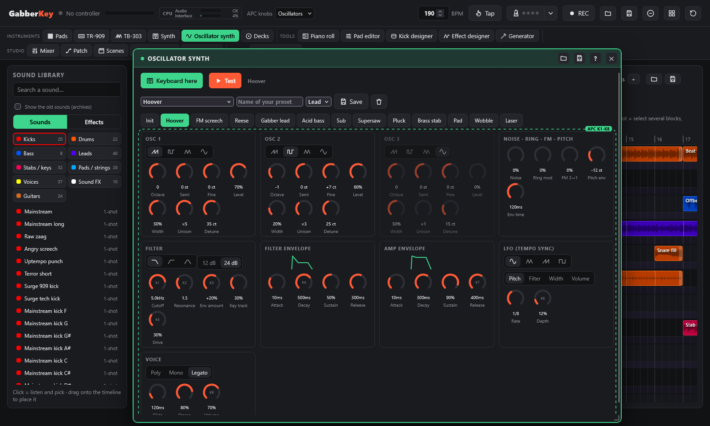](docs/screenshots/osc-en.png) |
| **Visualizer: fractal + kaleidoscope + glitch** [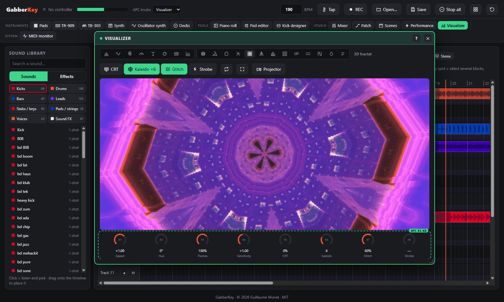](docs/screenshots/viz-en.png) | **Visualizer: 3D landscape** [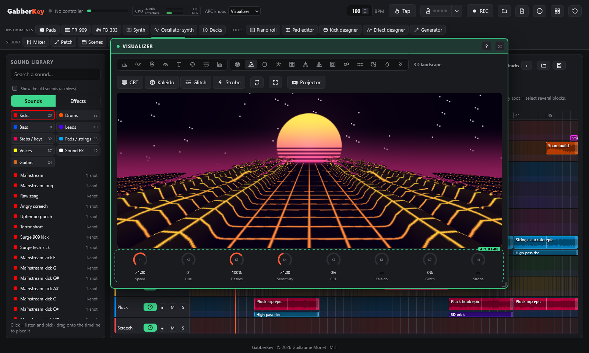](docs/screenshots/viz3d-en.png) |

## Quick start

1. Get the project: `git clone https://github.com/guillaumemonet/gabber-apckey25.git`, or the ZIP from GitHub.
2. Run `start.bat` (Windows) or `./start.sh` (macOS / Linux), then open http://localhost:8025 in Chrome, Edge or Firefox.
3. Click **Start** and allow MIDI devices. The APC Key 25 is optional: everything also works with the mouse and the computer keyboard.

All you need is Python 3, for the small local server. Details: [Getting started](docs/manual/getting-started.md).

## Manual

The complete guide is in [docs/manual](docs/manual/README.md); every window in the app also has its own help (**?** button).

1. **[Getting started](docs/manual/getting-started.md)**: Requirements, Installation, Starting, Language, Hardware compatibility
2. **[The APC Key 25 controller](docs/manual/controller.md)**: Controls on the APC, Knobs, Performance effects
3. **[Pads and banks](docs/manual/pads.md)**: Banks, Tempo and loops
4. **[Timeline, library and piano roll](docs/manual/timeline.md)**: Timeline and sound library, Piano roll, Demo
5. **[Instruments](docs/manual/instruments.md)**: TR-909, TB-303, Synth, Oscillator synth, Kick designer
6. **[Generator: chords and melody](docs/manual/generator.md)**
7. **[Mixing and effects](docs/manual/mixing.md)**: Effect designer, Mixer, Patch
8. **[Live: turntables, scenes, visualizer](docs/manual/live.md)**: Turntables, Scenes, Visualizer, Plugin windows
9. **[Files and recording](docs/manual/files.md)**: Saving and opening, Recording and kits
10. **[Troubleshooting](docs/manual/troubleshooting.md)**: Troubleshooting, Rebuilding the sound banks (optional)

## Roadmap

Goal: make GabberKey a professional tool, in the studio and on stage, step by step.

1. **Foundations**: automated tests, code split into modules, sounds loaded on demand, complete manual. *(done)*
2. **Pro mixing**: insert effects on every track, buses, a master chain (compressor, limiter, LUFS meter), solo.
3. **Editing**: split a block, fades, gain, reverse, transpose, context menu, markers, undo / redo everywhere.
4. **Automation**: setting curves drawn on the timeline.
5. **Live**: clip launcher, MIDI learn for other controllers, MIDI clock.
6. **Key and stretching**: transposition and time-stretching that keeps the pitch (today a 150 BPM loop played at 190 goes up by 4 semitones).
7. **Inputs**: audio recording (microphone, sound card) and MIDI files.

Ideas kept for later: a **step sequencer** for any sound, a **vocal sampler and vocoder**, a **build-up designer** (riser, snare roll, sub drop), **several instances** of the TB-303 and TR-909, a **break slicer**, a **TR-808**, an **online version** playable without installing anything, and an **AI loop generator** (an open-source music model running on your own computer).

Ideas and suggestions are welcome in the [issues](https://github.com/guillaumemonet/gabber-apckey25/issues).

## Hardware compatibility

GabberKey is developed and tested with an **Akai APC Key 25 mk1**. The **mk2** is supported from Akai Professional's MIDI documentation, but has not been tested on a real unit yet. Everything also works with the mouse and the computer keyboard.

> **A word to hardware makers** 🙏
>
> Today GabberKey is played with the only controller I own, an APC Key 25. If you make MIDI controllers, keyboards, pad controllers or grooveboxes and would like to check whether your product works with GabberKey, I would be truly delighted to make it as compatible as possible, and to share the result freely with everyone who plays your instruments. If you would be kind enough to lend or send a unit, please get in touch by [opening an issue](https://github.com/guillaumemonet/gabber-apckey25/issues) on this repository. Thank you very much for your time and for your kindness!

## For developers

GabberKey is a web page with no build step and no dependencies: audio engines (`js/*.js`) and the app, one module per area (`js/app/`). Code layout, conventions and project structure: [docs/dev](docs/dev/README.md) (in French).

`npm test` checks the code (syntax, translations, help pages, sound files) and then runs about 50 tests in Firefox (headless), each checking one area of the app: pads, instruments, timeline, effects, files, decks, visualizer, library. They also run on GitHub on every push. Requirements: Node.js 18+ and Firefox, nothing to install. Details and how to write a test: [docs/dev/tests.md](docs/dev/tests.md) (in French).

## Credits

- Design and development: **Guillaume Monet**
- Banks 2-6: [Sonic Pi](https://github.com/sonic-pi-net/sonic-pi) samples, public domain (CC0). See `sounds/CREDITS.md`.
- Gabber banks and starter kit: synthesised by GabberKey's own code.
- APC Key 25 mk2 MIDI protocol: Akai Professional documentation.

## License

Code released under the [MIT License](LICENSE) © 2026 Guillaume Monet. The Sonic Pi samples in banks 2-6 remain public domain (CC0).

Akai Professional and APC are trademarks of inMusic Brands, Inc. Roland, TR-909 and TB-303 are trademarks of Roland Corporation. GabberKey is an independent project, not affiliated with or endorsed by these companies.
