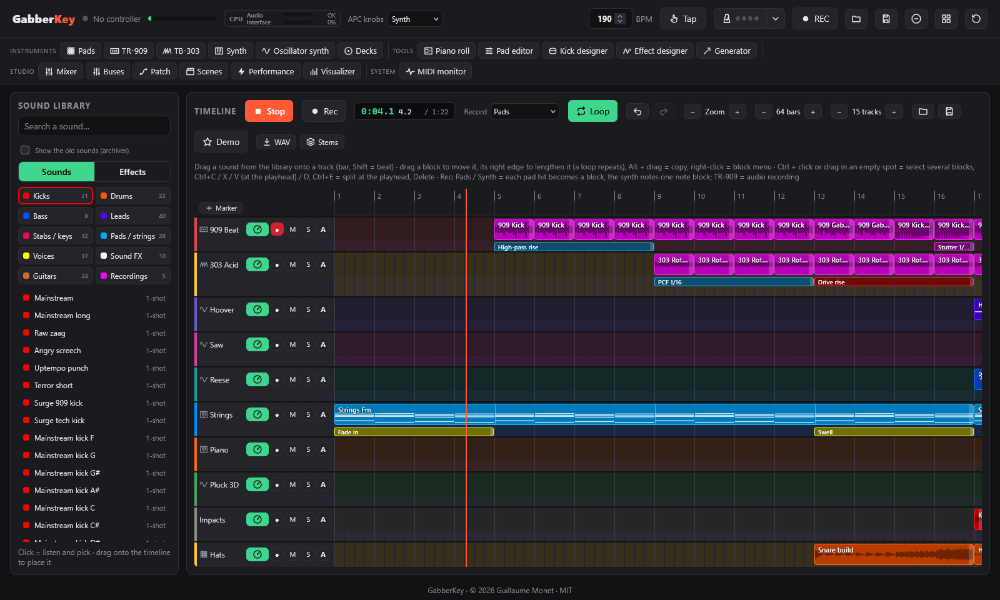
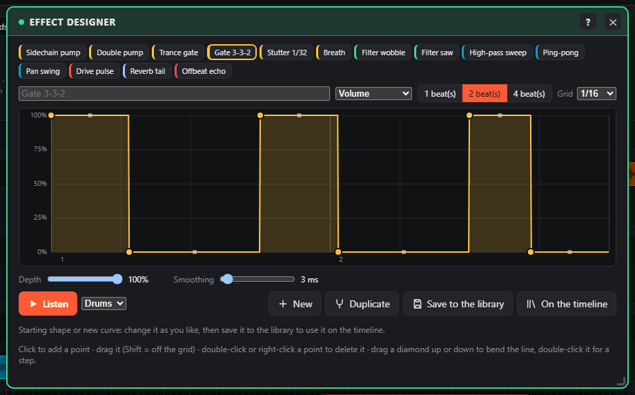

# GabberKey

**A complete music studio in your browser, born for hardcore / gabber, played with an Akai APC Key 25.**

*By Guillaume Monet* · [Version française](README.fr.md) · <sub>[☕ Support the project](https://paypal.me/holythunderblade)</sub>


GabberKey is built around a **timeline**: drag sounds from a library sorted by category onto tracks, the blocks snap to the bar and everything plays at the same tempo. The other tools (sampler pads, TR-909, synth, mixer, effects…) are **plugins** that open in windows, and the Akai APC Key 25 (mk1 or mk2) plays them live. Nothing to install except a web browser:

- **Timeline**: 16 tracks to start (up to 64), each with its own knobs (volume, pan, filters, sends); drag, lengthen (loops repeat), copy and move blocks; play the pads or the keyboard while recording and every hit becomes a block, live, and the synth notes one note block; edit the notes in a **piano roll**; record the TR-909 as audio; select several blocks and copy / paste them.
- **Sound library**: 598 sounds sorted into Kicks, Drums, Bass, Leads, Stabs / keys, Pads / strings, Voices, FX and Guitars, plus your own sounds and recordings; click to listen, drag to place.
  - nine **synthesised hardcore / gabber / hardstyle banks** (no duplicates), including two banks of **80 melodies**: distorted Rotterdam and terror kicks, hoovers, rave stabs, screeches, hardcore basses, dramatic strings, oldschool rave pianos, breakbeats, dark mainstream kicks and leads, modern uptempo kicks with raw tails, supersaws, shouts, FX and loops at 190 BPM;
  - five banks of **public-domain (CC0)** samples.
- **Plugins** in movable, magnetic windows:
  - **40-pad sampler** with 20 banks, pad LEDs synced to the screen, and drag & drop of your own sounds;
  - **TR-909 emulation**: the 11 instruments synthesised live, per-instrument **distortion (drive + 5 shapes)**, 16-step sequencer with 8 patterns;
  - **Piano roll**: edit the notes of the synth blocks (pitch, length, velocity, copy / paste, quantize, step input from the APC keyboard);
  - **Kick designer**: build your own distorted kick from 12 knobs and 8 presets, then send it to a pad or the library;
  - **Effect designer**: draw the curve of an effect (volume, filters, pan, saturation, sends) over 1, 2 or 4 beats and put it on any track;
  - **Turntables**: two decks with scratchable records (forwards and backwards), sync, cue, EQ, DJ filter and crossfader;
  - **TB-303-style acid bass line**: 16-step sequencer with accent and slide, resonant filter with envelope, distortion, step entry from the APC keyboard, in sync with the 909;
  - **Oscillator synth**: 3 oscillators with unison, FM, ring modulation, noise, 12 / 24 dB filter, 2 envelopes, tempo-synced LFO, poly / mono / legato, 12 presets and your own;
  - **Layered synth** on the keyboard: 35 presets in 10 families (strings, pads, choirs, supersaw, hoovers, leads, basses, stabs, keys, FX) with ensemble, stereo width, vibrato and 8 expression knobs, chord mode and a tempo-synced arpeggiator;
  - **Mixer**: one channel per tool with pan, delay and reverb sends, mute / solo, meters, up to 4 insert effects, and a **sidechain** triggered by the kicks;
  - **Patch**: wire the tools and **effect boxes** (distortion, PCF, filter, delay, reverb, compressor, bitcrusher) freely, everything in sync with the tempo;
  - **Visualizer** in the Winamp spirit: 21 modes (LED spectrum, oscilloscope, Milk swirls, hi-fi VU meters, text slam, particles, Amiga bars, spectrogram, and 3D / GPU modes: tunnel, synthwave landscape, blob, hyperspace, fractal, lasers, spectrum city, LED wall, metaballs, plasma, rotozoomer, fluid, reaction-diffusion), stackable filters (CRT, kaleidoscope, glitch, strobe), and a projector window for a second screen;
  - **Performance effects** (rolls, filter sweeps, tape stop, pump), **master EQ**, **scenes** recalled on the next bar, **MIDI monitor**.
- **Save and open** the whole project, the song or the settings of each tool (`.gabber` files), **fast WAV export and stems**, **WAV recording** of your session and **kit export / import**.
- Interface in **English or French**, following the browser language.

> 🚧 **GabberKey is constantly evolving.** New features land regularly, and plenty more is on the way: MIDI learn for other controllers, an online version… and much more. Star or watch the repository to follow what's coming (see the [roadmap](#roadmap))!

---

## Screenshots

| | |
|---|---|
| **Sampler pads and pad editor**<br>[](docs/screenshots/pads-en.png) | **Synth and pad generator**<br>[](docs/screenshots/synth-en.png) |
| **TR-909**<br>[](docs/screenshots/tr-en.png) | **TB-303**<br>[](docs/screenshots/acid-en.png) |
| **Kick designer**<br>[](docs/screenshots/kick-en.png) | **Turntables**<br>[](docs/screenshots/decks-en.png) |
| **Mixer and sidechain**<br>[](docs/screenshots/mixer-en.png) | **Patch**<br>[](docs/screenshots/patch-en.png) |
| **Track effects**<br>[](docs/screenshots/tlfx-en.png) | **Scenes and performance**<br>[](docs/screenshots/scenes-en.png) |
| **Piano roll**<br>[](docs/screenshots/roll-en.png) | **Oscillator synth**<br>[](docs/screenshots/osc-en.png) |
| **Visualizer: fractal + kaleidoscope + glitch**<br>[](docs/screenshots/viz-en.png) | **Visualizer: 3D landscape**<br>[](docs/screenshots/viz3d-en.png) |

## Requirements

- An **Akai APC Key 25**, mk1 or mk2. It is optional: everything also works with mouse and computer keyboard.
- **Google Chrome**, **Microsoft Edge** or **Firefox** (108 or later). Safari does not support Web MIDI.
- **Python 3**, only to serve the page locally (Web MIDI requires `localhost` or HTTPS).
- **WebGL** (in every recent browser) for the 3D modes and the filters of the visualizer; without it, the 2D modes still work.

## Installation

```bash
git clone https://github.com/guillaumemonet/gabber-apckey25.git
cd gabber-apckey25
```

Or download the ZIP from GitHub and unzip it.

## Starting

1. Plug in the APC Key 25.
2. Start the local server:
   - **Windows**: double-click `start.bat`.
   - **macOS / Linux**: run `./start.sh`.
   - **Anywhere**: run `python tools/serve.py`, then open http://localhost:8025.
3. In the browser, click **Start**, then **allow MIDI devices** when the browser asks.

The header shows **APC Key 25 (mk1)** or **APC Key 25 mk2** with a green dot once the controller is detected.

## Controls on the APC

| Control | Action |
|---|---|
| **Pads** | Play the sound (the last pad hit becomes the selected pad) |
| **Shift + pad** | Select a pad without playing it |
| **SCENE LAUNCH 1-5** | Banks 1-5 · **Shift +** SCENE LAUNCH = banks 6-10, press it again for banks 11-15, a third time for banks 16-20 (the LED blinks for banks 6-20; the screen shows the bank number) |
| **Track buttons 1 / 2 / 3 / 4** | Knob page: Synth / Effects / Selected pad / EQ |
| **Track buttons 5 / 6 / 7 / 8** (hold) | Roll 1/8 · Roll 1/16 · Roll 1/32 · Filter down |
| **Shift + track 5 / 6 / 7 / 8** | Roll 1/4 · Tape stop · Filter up · Pump (on/off) |
| **Shift + track 1 / 2 / 3 / 4** | Mixer knob page: volumes / pans / delay sends / reverb sends (K1 Pads, K2 Synth, K3 TR-909, K4 Timeline, K5 TB-303, K6 Decks, K7 Oscillator synth, K8 master) |
| **Knobs K1-K8** | Parameters of the current page, which follows the active window (Shift = fine tuning) |
| **SUSTAIN** | Opens / closes the EQ page (held: EQ while pressed) |
| **Shift + white key** | Preset of the current synth family (C = 1st, D = 2nd…) · **Shift + C# / D#** = previous / next family · **Shift + F# / G# / A#** = chord type / arpeggio on-off / arpeggio speed |
| **Keyboard** | Plays the synth of the active window (Synth or Oscillator synth) |
| **PLAY** | Start / stop the timeline (the TR-909 has its own ▶ in its window) |
| **Shift + PLAY** | Turn the pad grid into the TR-909 (and back) |
| **REC** | Record the chosen tool into the armed timeline track (and stop) · **Shift + REC** = TB-303 knob page, twice = turntables |
| **STOP ALL CLIPS** | Stops everything |
| **Shift + STOP ALL CLIPS** | Turn the pad grid into the 40 scenes (and back) |

**LEDs**: a loaded pad shows its colour, and a playing pad is fully lit or blinks. The mk1 only has three colours (red, green, yellow), so the colour picker shows those three when an mk1 is connected.

Everything can also be done with the mouse. On the computer keyboard, the middle row plays notes and **Z / X** change the octave.

## Banks

[](docs/screenshots/pads-en.png)

| Bank | Content |
|---|---|
| 1 | Starter kit, synthesised in the browser |
| 2 | Drums |
| 3 | Electro |
| 4 | Loops (22 loops at 120 BPM) |
| 5 | Textures & basses |
| 6 | Tabla & misc. |
| 7 | **Gabber**: 8 kicks (Rotterdam, Early, Terror, Industrial, Frenchcore, Reverse…), percussion, hoovers, stabs, screeches, loops at 190 BPM |
| 8 | **Gabber 2**: darker "doomcore" kicks tuned from C to G, FX (riser, downlifter, laser, impact…), 16 loops (frenchcore, half-time, doomcore beat, kick triplets, second hoover, stab and acid riffs, snare build…), rave stabs |
| 9 | **Hardcore**: harder kicks (terror, uptempo, speedcore, industrial, mainstream…), distorted basses, string chords (Fm, Db, Eb, Cm, Bbm, Ab), staccato and orchestra hit, string / bass loops (ostinato, progression, offbeat, rolling, reese, 4-bar full track) and hardcore drum loops, all at 190 BPM |
| 10 | **Oldschool** (early 90s rave / hardcore): 909 and 808 kicks, breakbeat kit, rave pianos (Fm, Db, Eb, Cm, Bbm, Ab), Mentasm and Belgian stabs, "ahh" choir, vox stab, whistle, air-raid siren, Amen-style and chopped breaks, piano riff, rave arp, 4-bar oldschool track, all at 190 BPM |
| 11 | **Mainstream** (dark mainstream hardcore, F harmonic minor): kicks with a distorted tonal tail (angry, dark, punchy, pitch drop, raw, tuned C# and G#), hard clap and percussion, dark and screaming leads, screeches, dark hoover, horror bells, dark piano, synthesised shouts ("hey", "oi", "yeah"), dark choir and strings, horror pad, loops (beat, lead riff, screech riff, bell melody, breakdown pad, build-up, 4-bar full track), all at 190 BPM |
| 12 | **New wave** (modern hardcore / uptempo): kicks with long raw "zaag" tails (zaag, raw, screech kick, hard punch, tok, kick-bass), 8 tuned kicks (F to F) for kick melodies, supersaw lead and chords (Fm, Db, Ab, Eb), pluck, pitch lead, euphoric pad, shouts, uplifter, tunnel, glitch, loops (uptempo beat, kick-bass, kick melody, gallop, supersaw chords, pluck melody, build-up, 4-bar drop), all at 190 BPM |
| 13 | **Hardstyle** (hardstyle / rawstyle, **150 BPM**): hardstyle, raw, screech, euphoric, zaag and punch kicks, tuned kicks C# and G#, **reverse basses** (F, C#, D#, G#), big clap, china crash, raw screeches, euphoric lead and chord, pluck, pitch lead, raw stab and hoover, shouts ("hey", "raw", "go"), pitch riser, uplifter, deep sub drop, impact, air horn, loops (hardstyle beat, the offbeat **reverse bass** groove, reverse bass over a chord progression, rawstyle loop, kick build-up, screech riff, euphoric melody, 4-bar drop) |
| 14 | **Melodies** (hardcore / gabber, 190 BPM, F minor): 40 melodic loops with no drums, to layer on any beat: themes (hoover, screech, horn, dark lead, mentasm, acid), emotional themes (piano, strings, staccato, bells, choir, pluck, supersaw), 2-bar hooks, chord / arpeggio / bass-line loops, and 8 full themes (melody + chords + bass) over the classic progressions Fm–Db–Eb–Cm, Fm–Db–Ab–Eb, Fm–Bbm–Db–C and Fm–Eb–Db–C |
| 15 | **Hardstyle melodies** (150 BPM): 40 loops: euphoric supersaw leads, raw screech melodies, raw leads and hoover, plucks, piano and bells intros, choir and strings, euphoric chords, reverse-bass lines, and 8 full anthems (lead + chords + reverse bass) |
| 16 | **Anthems** (190 BPM, F minor, 4-bar loops, all over the same chords Fm–Db–Eb–Cm so they **layer** with each other): big anthem leads (supersaw + hoover layered an octave apart, plus hoover, screech and horn versions), **distorted guitars** double-tracked in stereo (chugs, power chords, gallop, riff, offbeat stabs, breakdown, lead, guitar + kick), layers to stack (pad, strings, choir, stabs, arpeggio, bells, offbeat bass, sub bass), anthem drum loops (beat, ride, gallop, kick-roll build-up, half-time, off-kick, clap stomp, tribal toms), and 8 full anthems (lead / guitar + chords + bass + drums) |

To load your own sound, drop an audio file (WAV, MP3, FLAC, OGG…) on a pad or on the editor, or use **Load a sound…**. Under the pad grid, **8 knobs** set the selected pad (volume, pitch, pan, filter, start, delay, reverb, mode), also on the APC knobs when the Pads window is active. The **✎ pencil** that appears when the mouse is over a pad opens the **pad editor** on it: name, LED colour, playback mode (**One-shot**, **Hold** or **Loop**) and the pad's **8 knobs** (volume, pitch, pan, filter, start, delay, reverb, mode), also on the APC knobs.

## TR-909

[](docs/screenshots/tr-en.png)

A Roland TR-909 emulation with its 11 instruments (bass drum, snare, 3 toms, rim shot, clap, closed / open hi-hat, crash, ride). Each one is synthesised live, like the analogue circuits of the original.

**Knobs** (under the grid of the TR-909 window; also on the APC knobs when the window is active, or with Shift + PLAY):

| K1-K4 | K5 | K6 | K7 | K8 |
|---|---|---|---|---|
| Parameters of the selected instrument (e.g. BD: Tune, Attack, Decay, Level) | **Drive**: distortion amount | **Shape**: Soft, Hard, Tube, Fold (wavefolder), Crush (bitcrusher) | Shuffle | 909 volume |

Every instrument has its own distortion. The bass drum starts with a "Tube" drive for the gabber sound. The accent amount is set with the slider on screen.

**Sound kits** (menu above the grid): the settings of the 11 instruments at once, distortion included: **Hardcore** (Gabber, Rotterdam, Terror, Industrial), **Classic** (Clean 909, House, Techno) and **FX** (Lo-fi crush, Folded). Turning a knob makes the sound custom; type a name, choose a category and **Save** to keep your own (★ in the menu), the bin deletes it. The patterns are not part of a kit.

**Sequencer**: 16 steps, 8 patterns, 4 of them preset (gabber, rave, breakbeat, kick roll). It runs on the same tempo and bar grid as the loops, so it stays in sync with them. A pattern change waits for the next bar. On screen, click a step to cycle note → accent → off, and click an instrument name to play and select it.

**APC grid in 909 mode** (Shift + PLAY):

| Row | Pads |
|---|---|
| 1-2 | The 16 steps of the selected instrument (red = playhead, green = note, yellow = accent) |
| 3 | BD, SD, LT, MT, HT, RS, HC, CH: play and select |
| 4 | OH, CR, RD, then **Accent** (new steps are accented), **Clear** (erases the instrument), **Mute** |
| 5 | Patterns 1-8 |

Pressing a SCENE LAUNCH button brings the grid back to the sampler pads.

## Demo

Click **Demo** in the timeline toolbar and choose a song. Press ▶ to listen, then change it as you like.



- **Demo 1: library loops**: about one minute at 190 BPM in F minor, built from the Gabber, Hardcore and Oldschool banks (intro with strings, gabber build-up with hoovers, first drop, oldschool break with Amen break, piano and choir, hardcore second drop with screech and strings, final kick build-up). Listen: [`demo/gabberkey-demo.ogg`](demo/gabberkey-demo.ogg) (rendered by `tools/render_demo.py` from `demo/demo.json`).
- **Demo 2: every tool**: 64 bars of hardcore at 190 BPM in F minor (Fm, Db, Eb, C), made in the app with as many tools as possible, on 15 named and coloured tracks:
  - **TR-909** (Rotterdam kit) and **TB-303** (Rotterdam sound) recorded live: gabber beat, kick roll, kick alone, acid line and squelch line;
  - **oscillator synth**: hoover hook, reese bass on the offbeats, supersaw an octave up, pluck (every melody is a note block you can open in the **piano roll**);
  - **layered synth**: epic strings and rave piano stabs;
  - a kick from the **kick designer** (Terror) on each drop;
  - library sounds: hats, snare builds, risers, crashes, impacts, shouts, screech, siren, choir;
  - **track effects**: filter rise and close, pumping filter, drive rise, wobble, stutter, tape stop, gate, reverb and delay throws, autopan, and the **3D** orbit, spiral, fly-by and zoom;
  - **track knobs**: volume, pan, filters, delay and reverb sends.

  Intro with strings and air-raid siren, build-up (acid line, snare build, "hey!"), first drop, break with piano and a pluck turning around you in 3D, second drop with supersaw, outro. Listen: [`demo/gabberkey-demo-2.ogg`](demo/gabberkey-demo-2.ogg). It is a song file ([`demo/gabberkey-demo-2.gabber`](demo/gabberkey-demo-2.gabber)): the 909 / 303 takes and the designer kick travel inside it.

## Timeline and sound library

The main screen: the **sound library** on the left, the **timeline** on the right (16 tracks and 32 bars to start, − / + to change the length and the number of tracks, from 4 to 64, zoom, **Loop**).

- **Library**: two tabs. **Sounds**: pick a category (Kicks, Drums, Bass, Leads, Stabs / keys, Pads / strings, Voices, Sound FX, Guitars, My sounds, Recordings). **Effects**: the track effects, by family (Volume, Filter, Space, Time, Saturation, 3D, and your Curves from the effect designer). Or search by name. **Click** a sound to listen to it (and pick it); the badge shows its length in bars (loops) or "1-shot".
- **Place**: drag a sound onto a track. It snaps to the start of the bar (hold **Shift** to place it on a beat). Clicking an empty cell places the last sound picked.
- **Edit blocks**: drag a block to move it (to another bar or track), drag its **right edge** to lengthen or shorten it (a loop repeats to fill the block), **Alt + drag** copies it, **double-click** listens to it (a note block opens in the **piano roll**), **right-click** or **Delete** removes it. Each track has a mute.
- **Name and colour**: double-click a track's name to rename it; its panel (dial button) also has the name and a background colour for the track.
- **Track knobs**: the dial button of each track opens its panel and knobs: **volume**, **pan**, **low-pass** and **high-pass** filters, **delay** and **reverb** sends. They act on everything the track plays, are saved with the song, undone with Ctrl+Z and included in the WAV export and the stems. The button lights up when a knob is no longer at its default value; **Reset** puts them all back.
- **Select several blocks**: **Ctrl + click** adds a block to the selection (or removes it), **drag in an empty spot** draws a selection box (Shift or Ctrl adds to the selection), **Ctrl+A** selects everything. Drag one of them to move the whole group (Alt = copy it). Track effect blocks are selected the same way.
- **Copy / paste**: **Ctrl+C** / **Ctrl+X**, then **Ctrl+V** pastes at the playhead, on the same tracks (the playhead moves to the end of what was pasted, so pressing again chains copies); **Ctrl+D** duplicates the selection right after itself; **Delete** removes it; **Esc** deselects.
- **Undo / redo**: **↶ / ↷** in the toolbar, or **Ctrl+Z** / **Ctrl+Shift+Z** (or **Ctrl+Y**). Every change to the timeline can be undone (placed, moved, lengthened or deleted blocks, generated pads, recordings, demo loading…), up to 100 steps.
- **Record by playing (live)**: arm one or **several tracks** (●), choose in each track's panel the **instrument it records** (Pads, Synth, Oscillator synth, TR-909, TB-303, Decks, or Auto = the **Record** menu of the toolbar; the track header shows its icon), set the playhead (click the ruler), then **● Rec** (or REC on the APC). Every armed track records its instrument at the same time, and the timeline plays (in a loop if Loop is on, unless an instrument is recorded as audio):
  - **Pads**: every pad hit becomes a block of that pad, where you hit it (snapped to the 16th note). The block replays the pad with its settings.
  - **Synth**: every note appears live and **grows while you hold the key**; when the recording stops, the notes of the take become **one note block** (from bar to bar), which replays with the synth that was played (current synth preset, or the oscillator synth) and opens in the piano roll.
  - Blocks appear live as you play, on the track that records the instrument. If it is taken at that moment, the block goes to the next free track (never to a track armed for another instrument). The notes go to the track of the synth the keyboard is playing. With Loop on, you can add hits on every pass.
  - **TR-909** / **TB-303** / **Decks**: the instrument starts on the timeline's bars and is recorded as audio into a block (also listed in the library under Recordings).
  - **■ Stop rec** (or REC again) ends the recording.
- **Play**: ▶ (or PLAY on the APC) plays from the playhead, and the same button stops; the view follows the playhead. Loops recorded at another tempo follow the global tempo. The timeline has its own channel in the mixer.

### Track effects

[](docs/screenshots/tlfx-en.png)

Each track has two parts: the **sounds** on top, and a thin **effects line** underneath. Drag an effect from the **Track FX** category of the library onto a track: it acts on **everything the track plays** (audio blocks, synth notes and chords, pad hits) **for the length of the block**, in time with the tempo. Effects add up: a fade in and a PCF at the same time both apply; overlapping effect blocks stack on several lines.

- **Edit** an effect block like a sound block: drag it (Alt = copy), drag its right edge to change its length, right-click or **Delete** to remove it, **double-click** to open its settings.
- **The effects bank** (30 effects, each with its own settings):

| Family | Effects |
|---|---|
| Volume | Fade in, Fade out, Swell, Gate 1/8 and 1/16, Mute |
| Filter | High-pass rise, Low-pass close, Wobble 1/4 and 1/8, **PCF** 1/8, 1/16, offbeat, gallop, 3-3-2, band-pass |
| Space | Reverb throw, Delay throw (the echoes keep going after the block), Auto-pan |
| Time | Stutter 1/8, 1/16, 1/32, Tape stop |
| Saturation | Drive rise, Bitcrush rise |
| 3D | 3D orbit, 3D fly-by, 3D zoom in / out, 3D spiral (binaural: best with headphones) |

- **PCF** is a rhythmic filter: low-pass (LP) or band-pass (BP), whose envelope restarts on each active step of a 16-step **pattern** (1/8, 1/16, 1/4, offbeat, gallop, 3-3-2, roll), with **Frequency**, **Q**, **Amount** and **Decay**.
- Everything is scheduled on the audio clock: effects stay in time, are undone with Ctrl+Z, and are included in the WAV export and the stems.

## Piano roll

[](docs/screenshots/roll-en.png)

Edits the notes of a **note block** of the timeline (synth recordings, generated pads, chords, arpeggios, or a new block).

- **Open a block**: double-click a note block on the timeline (while the window is open, a click is enough), or **+ New block** (1 bar at the playhead, on the armed track). A **synth recording becomes a single note block**, ready to edit.
- **Draw**: click an empty spot to add a note (drag to set its length), drag a note to move it (**Alt** = copy), drag its right edge for its length, **right-click** to erase. **Shift + drag** selects a group.
- **Keys**: Delete, Ctrl+A / C / X / V (paste at the green cursor, set by clicking the ruler), **Ctrl+D** duplicates after itself, ↑ / ↓ transpose (Shift = octave), ← / → move by one grid step (Shift = one bar), **Q** quantizes, **Space** listens, Ctrl+Z undoes.
- **Velocity**: drag in the bottom lane.
- **Grid** from 1/4 to 1/32, with triplets; **Quantize** snaps the start and end of the notes. The rows of the F minor scale (the key of the banks) are tinted.
- **Length** −/+ sets the length of the **pattern**: on the timeline the block repeats it over its whole length (drag its right edge), like a loop. Notes drawn after the end lengthen the pattern.
- **Sound**: each block can have its own synth preset, or play the sound currently on the keyboard. **Merge** gathers the neighbouring note blocks of the track (same sound) into one.
- **Step input**: the notes played on the APC keyboard (or the computer keyboard) go in at the cursor, chords included, and the cursor moves on by one grid step.
- **▶ Listen** loops the pattern alone; while the timeline plays, the playhead is shown in the piano roll too.

## TB-303

[](docs/screenshots/acid-en.png)

An acid bass line in the style of the Roland TB-303, synthesised live: oscillator (saw or square), resonant 24 dB low-pass filter driven by an envelope, accent, slide, then distortion with the 909's 5 shapes.

- **Grid**: 16 steps (16th notes) × one octave from F to high F. Click a cell to place a note, again for a rest. The **Oct + / Oct −** rows shift a step by an octave, **Accent** makes it louder with a snappier filter, **Slide** glides into the next note without retriggering the envelope (the famous "squelch").
- **Sound presets**: 15 ready-made sounds in 4 categories: **Acid** (classic, squelch, screamer, Rotterdam, hoover), **Bass** (rubber, sub, dark roller), **Lead** (saw lead, squeal, gabber lead) and **FX** (laser, siren, crushed, zap). Turning a knob makes the sound custom; give it a name and a category and **Save** it to keep your own presets (★), saved with the session and in the TB-303 settings files.
- **Knobs**: tune, cutoff, resonance, envelope amount, decay, accent, **slide** (glide time between linked notes), drive, shape, volume. On the APC, **Shift + REC** opens the TB-303 knob page (K1 cutoff … K8 volume).
- **8 patterns**, 4 of them ready-made in F minor (acid gabber, rolling 16ths, squelchy slides, minimal offbeat). A pattern change waits for the next bar. **Random** writes a new acid line in F minor; **Clear** empties the pattern.
- **Follow 909** (on by default): the 303 plays on the TR-909's clock, shuffle included, and ▶ starts both. Turn it off to play the 303 on its own, on the loops' bar grid.
- **Step entry**: turn on **Step entry** and play the line on the APC keyboard (or the computer keyboard). Each note goes into the selected step and the cursor moves on; a strong hit adds an accent, **Rest** leaves a step empty, clicking a step number moves the cursor.
- The 303 has its own **mixer channel** (K5 on the mixer knob pages), is ducked by the **sidechain** with the melodic sounds, is stored in **scenes** (pattern and transport), and can be **recorded** into the timeline as audio (choose TB-303 as the source).

## Kick designer

[](docs/screenshots/kick-en.png)

Build your own gabber / hardcore kick, computed by the browser in a few milliseconds from 12 knobs:

- **Presets**: Rotterdam, Mainstream, Uptempo, Raw, Terror, Industrial, Early, Frenchcore (buttons), also in a menu by category (Gabber, Hardcore, Mainstream / uptempo) with your own kicks. Turning a knob makes the sound custom; type a name, choose a category and **Save** to keep your own (★ in the menu), the bin deletes it.
- **Tail**: **Tune** (note of the tail, in tune with the banks), **Punch** and **Sweep** (how high the pitch starts and how fast it drops), **Tail drop** (how far it keeps falling), **Length**, **Zaag** (sawtooth for the raw, buzzing tail of uptempo kicks).
- **Distortion**: **Drive** and **Shape** (the 909's 5 shapes), then **Formant** and **Bite**, which make the tail "talk".
- **Attack**: **Click** (noise) and **Attack** (short punchy layer).
- **Auto-listen** plays the kick each time you release a knob; the waveform and the length are shown.
- **→ Pad** puts it on the selected pad, **→ Library** adds it to the **Kicks** category of the library (drag it onto the timeline; right-click it there to remove it), **⤓ WAV** downloads it. Your kicks trigger the sidechain like any other kick.

## Effect designer

[](docs/screenshots/curve-en.png)

Draw how a setting of a track moves over **1, 2 or 4 beats**: the shape repeats in a loop, locked to the tempo, for as long as its block lasts on the timeline (a sidechain pump made by hand, a trance gate, a filter wobble, a pan swing…).

- **Setting driven**: volume, low-pass filter, high-pass filter, pan, saturation, reverb send or delay send.
- **Editing**: click to add a point and drag it (snapped to the grid: 1/4, 1/8, 1/16, 1/32 and triplets; **Shift** = free), double-click or right-click a point to delete it. The **diamond** between two points bends the line (drag it up or down); double-click it for a **step**: the value holds until the next point.
- **Depth** brings the curve back towards "no effect" (shown dotted), **Smoothing** rounds off the steps so they never click. For the filters, the extreme cutoff and the resonance.
- **Listen** plays a library loop (drums, bass, strings or hoover) through the curve, with a playhead: every change is heard right away.
- **14 starting shapes**: sidechain pump, double pump, trance gate, 3-3-2 gate, stutter 1/32, breath, filter wobble, filter saw, high-pass sweep, ping-pong, pan swing, drive pulse, reverb tail, offbeat echo. Change one, then **Save to the library**: it becomes your curve.
- **On the timeline**: your curves are in the library, **Effects › Curves**. Drag one onto a track like any track effect, or click **On the timeline** (at the playhead, on the selected block's track). The block shows the shape. Changing your curve changes all its blocks at once, even while the song plays; double-click a curve block to open it in the designer.
- Your curves are saved with the project, travel inside song files and are in the WAV export and the stems.

## Turntables

[](docs/screenshots/decks-en.png)

Two decks to mix and scratch any sound: library loops, your recordings, your own audio files.

- **Load**: drag a sound from the library (or an audio file) onto a deck, or click a sound in the library then **Load**.
- **▶ / ❚❚** play / pause. **Cue**: while playing, back to the cue point and pause; when stopped, sets the cue point. Click the waveform to jump.
- **Sync**: the deck follows the global tempo (when the sound's tempo is known: library loops, or guessed for long files), keeps following it when you change the tempo, and starts on the next bar. Without Sync, the **Pitch** slider changes the speed by ±8 %.
- **Scratch**: hold the record with the mouse and move it, forwards or backwards; release it to let it play again. Like on a real turntable, the record follows the **position** of the hand (not its speed), with a little inertia that smooths the mouse out; when you let go, it keeps the hand's momentum and the motor brings it back to speed in a tenth of a second. The sound is read by a dedicated audio processor (4-point interpolation, anti-aliasing when it goes fast): it really plays backwards and follows the hand.
- **Display**: a zoomed waveform that scrolls past the playhead, 4 bars with the beat grid and the bars numbered, bass in orange (to line up the kicks by eye); the whole sound underneath (click to jump); the platter with its strobe dots, the record and its label, and the tone arm.
- **Auto transition** (next to the crossfader): mixes from the deck that plays to the other one, choosing the best way. The incoming deck starts exactly on the next **phrase** of the playing one (8 bars, or 4 if 8 would make you wait too long), phase-aligned. The transition lasts **16 bars** when the incoming sound starts calm (an intro), **8** otherwise, less if the outgoing sound ends before. The incoming deck comes in without bass and slightly filtered, the crossfader moves to the middle, the **basses swap** sharply on the middle bar, then the outgoing deck fades away (high-pass filter, treble down) and stops; its settings go back to neutral. You see the knobs move. Without a known tempo: an 8-second fade. Touching the decks (crossfader, a knob, the record, ▶) takes over; clicking the button again stops it.
- Per deck: **Volume**, **Bass**, **Mid**, **Treble** (all the way left = cut) and a DJ **Filter** (left = low-pass, right = high-pass); a constant-power **crossfader** between A and B.
- On the APC, **Shift + REC** twice opens the turntable knob page (K1-K3 = deck A volume, bass, filter; K4-K6 = deck B; K7 = crossfader; K8 = master). The decks have their own mixer channel (K6 on the mixer pages) and can be recorded into the timeline (source Decks).

## Scenes

[](docs/screenshots/scenes-en.png)

40 scenes laid out like the APC grid (1-8 at the bottom). A scene stores:
- the loops that are playing;
- the TR-909 pattern and its muted instruments;
- the mixer levels, pans, sends, mutes and solos;
- the synth preset, the tempo, and whether the transport is playing.

- **Launch**: click a scene. Everything switches **on the next bar**: new loops start, the others stop, patterns change and the mixer follows.
- **Save** the current state: Shift + click, or turn on **Save mode**. Right-click clears a scene.
- **APC**: **Shift + STOP ALL CLIPS** turns the pad grid into the 40 scenes. Pad = launch, Shift + pad = save, Shift + STOP ALL CLIPS again (or a SCENE LAUNCH button) to exit. LEDs: green = stored, red = current, blinking = waiting for the next bar.

## Mixer

[](docs/screenshots/mixer-en.png)

One channel per tool: **Pads**, **Synth**, **TR-909**, **Timeline**, **TB-303**, **Decks** and **Oscillator synth**, then the master (performance effects, master EQ and limiter). The level of each sound stays in its tool (pad volume, 909 instrument levels); the mixer balances the tools.

Each channel has insert effects (**+ FX**, up to 4, applied in order), reverb and delay sends, pan, a fader (0 dB at three quarters), **M**ute, **S**olo and a meter. Available effects:
- **Distortion**: drive and the 5 shapes of the 909.
- **Filter**: low-pass or high-pass, cutoff and resonance.
- **Compressor**: threshold, ratio and gain.
- **Reverb**: size and mix.

Double-click a control to reset it. On the APC, **Shift + track button 1 / 2 / 3 / 4** turns the knobs into the mixer's volumes / pans / delay sends / reverb sends: K1 = Pads, K2 = Synth, K3 = TR-909, K4 = Timeline, K5 = TB-303, K6 = Decks, K7 = Oscillator synth, K8 = master volume. The mixer settings are saved and included in session exports.

### Sidechain

At the top of the mixer window. When it is **On**, every kick ducks the **synth** and the **oscillator synth** (keyboard, note and chord blocks), the **TB-303** and the **melodic sounds** (pads and timeline blocks in the Bass, Leads, Stabs / keys, Pads / strings and Voices categories), which then come back up smoothly: the track breathes with the kick. Kicks and drums are never ducked.

- **Triggered by**:
  - **Kicks**: the TR-909 bass drum, the kick pads and blocks, and the kicks of the GabberKey loops (their exact positions are stored in the library: a gallop, a roll or a build-up ducks on each of its kicks). A recording of the 909 in the timeline keeps the position of its kicks too.
  - **Every beat**: on each beat of the grid, for loops whose kicks are unknown (Sonic Pi loops, your own loops).
- **Depth** (how far the sound goes down) and **Release** (how long it takes to come back up); double-click to reset.
- **Ducks**: choose the synth, the melodic sounds, or both. The meter shows the ducking in real time.
- The ducking is scheduled at the exact time of each kick (on the audio clock), not detected afterwards: no delay, and it stays in time at any tempo.

## Patch

The **Patch** window wires the tools and **effect boxes** freely, like a rack of hardware. By default every tool goes straight to the master: nothing changes until you touch it.

[](docs/screenshots/patch-en.png)

- On the left, one block per **tool**: pads, synth, TR-909, timeline, TB-303, turntables, oscillator synth. Each tool keeps its **mixer channel** (volume, pan, mute, solo, insert effects, sends); the patch decides where that channel goes. On the right, the **Master**.
- **Effect boxes**: **Distortion** (drive, the 909's 5 shapes, tone, mix), **PCF** (rhythmic LP / BP filter restarted by a 16-step pattern, always on the tempo grid), **Filter** (LP, HP or BP with a tempo-synced LFO), **Delay** (in note values: 1/4, 1/8, dotted 1/8, 1/16, quarter-note triplet), **Reverb**, **Compressor**, **Bitcrusher**. Double-click a box for its settings, ✕ removes it.
- **Wire**: drag from an output (right-hand socket) onto a box or the master. An output can feed several destinations, a box can receive several sources, and boxes can be chained. A cable that would create a loop is refused. **Click a cable** to unplug it. A tool that goes nowhere is silent: the mixer shows where each channel goes, under its name.
- **All to master** wires every tool straight to the master again. The fast WAV export and the stems rebuild exactly the same wiring.

## Plugin windows

The bar under the header opens and closes the plugins, in four groups: **Instruments** (Pads, TR-909, TB-303, Synth, Oscillator synth, Decks), **Tools** (Piano roll, Pad editor, Kick designer, Effect designer), **Studio** (Mixer, Patch, Scenes, Performance, Visualizer) and **System** (MIDI monitor). Each one opens in a window above the timeline:
- Each window has a title bar: the **title** on the left, **?** and **✕** on the right.
- The **active window** (in front) is highlighted; windows open and close with a 3D transition.
- **Move** it by its title bar, **resize** it by its bottom-right corner; it **snaps** to the screen edges and to the other windows.
- **?** opens the **help** for the window's content, next to it (**?** again, ✕ or Esc closes it).
- **✕** closes it; the windows you use are remembered with their position.
- The tools whose settings can be saved (TR-909, TB-303, Synth, Oscillator synth, Kick designer, Mixer, Patch, Scenes) also have **📁 / 💾** buttons in their title bar (see Saving and opening).
- The **Reset windows** button (four squares, in the header) puts them back in their default place and size.

## Synth

[](docs/screenshots/synth-en.png)

The keyboard plays a layered synth built for hardcore: every preset stacks up to 3 **layers** of oscillators (saw, square, triangle, sine or pulse, each with its own unison, octave and level), with **formants** (string body resonance, "a" / "o" choir vowels), a stereo **ensemble**, unison spread across the stereo field, and a vibrato that comes in after a moment.

**35 presets in 10 families** (Synth window, or **Shift + white key** on the APC = preset of the family, **Shift + C# / D#** = previous / next family):

| Family | Presets |
|---|---|
| Strings | Epic, Dark, Staccato, Vintage, High |
| Pads | Thunderdome, Dark, Warm, Glass, Sweep |
| Choirs | Rave, Ooh, Dark |
| Supersaw | Uplifting, Hardstyle lead, Pad, Stab |
| Hoovers | Hoover, Mentasm |
| Leads | Init, Acid 303, Screech, Horn, Gabber lead |
| Basses | Distorted, Reese, Sub |
| Stabs | Rave, Belgian, Orchestra hit |
| Keys | Rave piano, Organ |
| FX | Tuned kick, Siren, Laser |

**8 expression knobs**, adapted to the family (in the Synth window and on the APC's Synth page):
- strings, pads, choirs, supersaw, stabs, keys: Brightness, Resonance, Attack, Release, **Width**, **Vibrato**, **Ensemble**, Reverb;
- hoovers, leads, basses, FX: Brightness, Resonance, Attack, Release, Drive, **Glide**, Detune, Reverb.

Double-click a knob in the Synth window to go back to the preset's value.

**Your presets**: the menu under the presets lists them all by family. Turning a knob makes the sound custom; type a name, choose a category and **Save** to keep your own (★ in the menu), the bin deletes it. A preset of yours keeps its starting sound and your 8 knobs.

### Chords and arpeggiator

Below the knobs of the Synth window:
- **Chords**: one key plays a whole chord: minor, major, sus2, sus4, minor 7th, fifth or octave. **In key (F minor)** builds the right chord of the scale on each key (F → Fm, G# → Ab, C# → Db, D# → Eb…), so everything stays in tune with the banks.
- **Arpeggio**: the held notes (or the chord) are played one after another, in time with the tempo and on the same grid as the loops. Speed 1/8, 1/16 or 1/32; order up, down, up-down, random or as played; range 1 to 3 octaves; note length; **Hold** keeps the arpeggio going after the keys are released (the next key starts a new one).
- On the APC: **Shift + F#** = next chord type, **Shift + G#** = arpeggio on / off, **Shift + A#** = arpeggio speed.

When the timeline records the synth, the chords and the arpeggio notes are recorded too, in the note block of the take.

### Pad generator

**Pad generator → timeline**, in the Synth window, opens the generator: it lays string or pad blocks on the timeline from a chord progression.

- **Progression**: type the chords separated by spaces or dashes (`Fm Db Eb Cm`, `Fm-Bbm-Db-C`…), or click a ready-made one. Recognised: major (`Db`), minor (`Fm`), `7`, `m7`, `maj7`, `sus2`, `sus4`, `dim`, `aug`, `5`, `add9`, with `#` / `b`.
- **Sound**: the current synth preset, or a preset from the strings, pads, choirs, supersaw, stabs or keys families. Each block keeps **its own preset**: you can play something else on the keyboard, or change preset, without changing the pads.
- **Register** (low, middle, high), **bars per chord** (1, 2 or 4), **repeat** (×1, ×2, ×4), **rhythm** (held, every beat, offbeat, 8th notes).
- **Bass**: none, sub (held), hardcore offbeat or reese (held), on the root of each chord, on a second track.
- The chords follow each other with smooth **voice leading**: common notes are kept and the others move as little as possible.
- **▶ Listen** plays the first chord; **Generate** places the blocks from the playhead's bar, on the first track that is free for the whole length, starting from the armed track. The timeline grows if needed.

A chord block works like any other block: move it, lengthen it, copy it (Alt), open it in the piano roll (double-click) or delete it.

## Oscillator synth

[](docs/screenshots/osc-en.png)

An analogue-style synth to build your own sounds, next to the layered synth.

- **Which synth the keyboard plays**: the APC keyboard (and the computer keyboard) plays the synth of the **active window**. Click the Oscillator synth window to play it, click the Synth window to go back (the **Keyboard here** button shows which one is played). Chord mode and arpeggiator work with both.
- **3 oscillators**: saw, pulse (with its **width**), triangle or sine; octave, semitone, fine tune, level, **unison** (up to 7 detuned copies spread in stereo) and their detune.
- **Noise, ring modulation** (osc 1 × osc 2), **FM** (osc 3 modulates osc 1, for screeches and bells) and a **pitch envelope** (each note starts higher or lower and slides to its pitch: lasers, hoovers).
- **Filter**: low-pass, high-pass or band-pass, **12 or 24 dB**, cutoff, resonance, envelope amount (negative closes it), key tracking, drive before the filter.
- **Two ADSR envelopes** (filter and volume), drawn above their knobs.
- **Tempo-synced LFO**: sine, triangle, saw or square, from 1/1 to 1/32 with triplets, on the pitch, the filter, the pulse width or the volume.
- **Voice**: polyphonic (8 notes), mono or legato (no new attack between linked notes), glide, stereo width, volume.
- **12 presets**: hoover, FM screech, reese, gabber lead, acid bass, sub, supersaw, pluck, brass stab, pad, wobble, laser, as buttons and in a menu by category (**Lead**, **Bass**, **Pad**, **FX**). Turning a knob makes the sound custom; type a name, choose a category and **Save** to keep your own (★ in the menu), the bin deletes it.
- **APC knobs**: K1-K8 = cutoff, resonance, filter envelope, filter decay, drive, LFO depth, release, volume (marked on screen) while the window is active.
- It has its own **mixer channel** (K7 on the mixer pages), is wired in the **Patch** window and ducked by the **sidechain** like the synth. What you record on it becomes a note block with its sound, and in the **piano roll** any note block can use one of its presets.

## Visualizer

[](docs/screenshots/viz3d-en.png)

A nod to Winamp, in the **Studio** group: music visualizations that follow the master output, made to be projected in **full screen** during a live set.

- **Spectrum**: LED bars from bass to treble (green, yellow, red) with peaks that fall back slowly, and their reflection.
- **Oscilloscope**: the glowing waveform with its trail, and a stereo figure in the corner.
- **Milk**: each image is fed back, zoomed and rotated, under a circle made of the waveform and spinning shapes: swirls and trails that punch on every kick.
- **VU meters**: two hi-fi needle meters (left / right, with peak lights) and an LED bar per mixer channel and for the master.
- **Text slam**: your own words (separated by commas), one per bar, slammed on every kick with colour splits.
- **3D (WebGL)**: a neon **tunnel** that flies by at the tempo, a synthwave **landscape** whose relief is the spectrum of the last two bars, a **blob** (a sphere deformed by the sound), **hyperspace** (stars flying at you, warp jump on every kick), a **3D fractal** (a flight inside an endless Menger sponge) and **lasers** sweeping the smoke above a jumping crowd.
- **Particles** (a sphere of points that bursts on every kick), **Amiga bars** with a sine scroller, **spectrogram**, and more 3D / GPU modes: **spectrum city** (neon towers made of the spectrum history), **LED wall**, **metaballs**, **plasma**, **rotozoomer**, **fluid** and **reaction-diffusion**.
- **Stackable filters** over any mode: **CRT**, **kaleidoscope**, **glitch** and **strobe** (at most 3 flashes per second). Changing mode makes a transition (fade, zoom or slices).
- **Knobs** (on screen, and on the APC while the window is active): speed, hue, flash strength, sensitivity and the amount of each filter.
- **Drop detection**: when the bass comes back after a break, the image explodes (and changes mode in Auto).
- **Projector**: the visuals alone in a **second window**, to drag to the projector screen and put in full screen (double-click) while you keep playing in the main window.
- Colours move on with the tempo and every **kick** makes a flash. **Auto** changes mode every 8 bars. **Full screen** (or F, or a double-click): a click shows the next mode, Esc leaves. Keys 1-9 and 0 choose the mode. Nothing is drawn while the window is closed.

## Tempo and loops

The global tempo (header) drives every loop. Each loop starts on the next bar and stays in sync when you change the tempo. For your own loops, enter their original tempo in the editor, or click **Auto**: this assumes the file lasts a whole number of bars. Set the tempo to 190 for the Gabber, Hardcore, Oldschool, Mainstream and New wave banks: their loops share the same key (F minor) and lengths, so they stay in sync with each other. The **Hardstyle** and **Hardstyle melodies** banks are made at **150 BPM**, the tempo of the style (their loops follow the global tempo too, but sound most natural at 150).

**Tap**: click it in rhythm, at least twice; each click flashes and the tempo found (average of the last clicks) is shown on the button.

**Metronome** (next to Tap): a click on every beat of the grid, higher on the first beat of the bar, with four lights that beat the bar. Its **▾** menu sets when it clicks (all the time, or only while recording), a **one-bar count-in before REC** and its volume. The click goes straight to the speakers: it is never in the WAV export, the stems or the recordings.

**CPU** (header, next to the level meter): two small bars. **Audio** is the load of the browser's audio engine: shown as a percentage when the browser measures it (few do so far); otherwise the bar stays at **OK** and only lights up red (**lags**) when the engine falls behind, which is when the sound gets choppy. **Interface** is the share of time the page is too busy to draw. The tooltip also counts the voices and sounds playing. If it gets too high: mute or remove tracks, use fewer track effects (the 3D ones cost the most), close the visualizer.

## Knobs

There is no global knob window: **each instrument has its knobs in its own window** (synth, oscillator synth, pads window and pad editor, TR-909 under its grid, TB-303, turntables, kick designer, visualizer), and the mixer has a **Master** section (master EQ, global effects and volumes).

The 8 knobs of the APC (K1-K8) control one **page** at a time:
- the page **follows the active window**: click the TB-303 and K1-K8 control the TB-303, click the TR-909 and they control the selected 909 instrument, and so on (synth, oscillator synth, turntables, pad editor, mixer, visualizer);
- the **APC knobs** menu in the header shows the current page and lets you choose it;
- the APC track buttons also change it (1-4 = Synth / Effects / Pad / EQ, Shift + 1-4 = mixer pages, Shift + REC = TB-303 then turntables, Shift + PLAY = TR-909, SUSTAIN = EQ).

The group of knobs driven by the APC is outlined on screen and tagged "APC K1-K8". The pages:
- **Synth**: the 8 expression knobs of the current synth family (see Synth)
- **Effects**: delay time / feedback / send, reverb send / size, synth volume, pads volume, master volume (Master section of the mixer)
- **Pad**: volume, pitch, pan, filter, start point, delay and reverb sends, and playback mode of the selected pad (pad editor)
- **EQ**: low 100 Hz, low-mid 350 Hz, mid 1.2 kHz, high-mid 3.5 kHz, high 9 kHz (±15 dB), low-pass, high-pass, output gain (Master section of the mixer)
- **TR-909**, **TB-303**, **Decks**, **Oscillators** (see Oscillator synth), **Visualizer** (speed, hue, flashes, sensitivity, filters) and the four **mixer** pages.

Double-click a knob on screen to reset it.

## Performance effects

- **Rolls** (beat repeat) lock to the grid: the repeat starts on the next 16th note.
- **Filter down / up** sweeps a low-pass or high-pass filter over one bar while you hold.
- **Tape stop** slows everything down to a halt.
- **Pump** ducks the synth on every beat.

## Saving and opening

GabberKey saves everything automatically in the browser, and you can also keep your work in **`.gabber` files** (to back it up, move it to another computer or share it):
- **Save project** (header): the whole project in one file: timeline, tempo, pads and banks, every tool, mixer, patch, scenes, windows, with your own sounds and recordings inside. **Open…** loads it back (everything is replaced, then the app restarts on it).
- **Song** (the 📁 / 💾 buttons of the timeline toolbar): the timeline alone (tracks, blocks, track effects, length, tempo) with the recordings it uses. Opening a song replaces the timeline (Ctrl+Z brings the previous one back).
- **Settings of a tool**: the 📁 / 💾 buttons in the title bar of the TR-909 (patterns and knobs), TB-303, Synth, Oscillator synth (with your presets), Kick designer, Mixer (with the sidechain and the master section), Patch and Scenes windows.
- Any **Open** button accepts any GabberKey file: it recognises what it contains and loads it where it belongs. Library sounds are referenced by name; imported sounds and recordings are embedded.

## Recording and kits

- **⤓ WAV** (timeline toolbar) exports the song as a WAV file, **rendered in a few seconds** instead of playing it in real time: from bar 1 to the end of the last block, with the synth, pads, mixer, insert effects and sidechain exactly as you hear them (about 3 s for the one-minute demo).
- **⤓ Stems** exports each non-empty track as its own full-length WAV file, all in one ZIP archive, ready to be mixed in another program.
- **● REC** in the header records the master output live, including what you play and the performance effects. Press it again to download a WAV file.
- **Export bank** / **Export all** creates a self-contained `.apckit` file with the sounds and settings. **Import…** loads it back: a bank goes into the displayed bank, and a session replaces everything.

Your banks, sounds and settings are saved automatically in the browser.

## Language

The interface follows the browser language: French if the browser is set to French, English otherwise. To force a language, add `?lang=en` or `?lang=fr` to the address.

## Roadmap

What is planned, in this order:

1. **Step sequencer for any sound**: program the pads (kicks, claps, shouts from the banks…) on a 16-step grid.
2. **Time-stretching that keeps the pitch**: loops follow the tempo without changing key (today a 150 BPM loop played at 190 goes up by 4 semitones).
3. **Vocal sampler and vocoder**: record with the microphone, chop, pitch and formant, robotic gabber vocoder.
4. **Build-up designer**: riser, noise sweep, snare roll and sub drop, set to a number of bars.
5. **Mastering chain**: multiband compressor, stereo width, limiter and a LUFS meter on the master.

Then: **several instances** of the TB-303 and TR-909 (each one wired where you want in the Patch window, all in sync), and a **MIDI element attached to each window**.

Other ideas kept for later: a **break slicer** (a break cut into 16 slices on the pads), a **lead designer** (hoover, screech), a **TR-808**, an **audio input** to resample anything onto a pad, **MIDI learn** for other controllers, timeline **markers, sections, loop region and tempo ramps**, recording a tool into the timeline **after** its effect boxes, an **online version** playable without installing anything, and an **AI loop generator** (an open-source music model running on your own computer: loops in the session's tempo and key, a layer added to your song).

Ideas and suggestions are welcome in the [issues](https://github.com/guillaumemonet/gabber-apckey25/issues).

## Hardware compatibility

GabberKey is developed and tested with an **Akai APC Key 25 mk1**. The **mk2** is supported from Akai Professional's MIDI documentation, but has not been tested on a real unit yet. Everything also works with the mouse and the computer keyboard.

> **A word to hardware makers** 🙏
>
> Today GabberKey is played with the only controller I own, an APC Key 25. If you make MIDI controllers, keyboards, pad controllers or grooveboxes and would like to check whether your product works with GabberKey, I would be truly delighted to make it as compatible as possible, and to share the result freely with everyone who plays your instruments. If you would be kind enough to lend or send a unit, please get in touch by [opening an issue](https://github.com/guillaumemonet/gabber-apckey25/issues) on this repository. Thank you very much for your time and for your kindness!

## Troubleshooting

| Symptom | Fix |
|---|---|
| "MIDI access denied" | Click the icon left of the address bar → MIDI devices → Allow, then reload. |
| "Port unavailable" | Another app (Ableton, FL Studio…) is using the APC. On Windows a MIDI port cannot be shared, so close that app and reload. |
| Detected but pads do nothing | Unplug the APC, wait 10 seconds, plug it into another USB port, then reload. Windows' MIDI service can stop delivering input after sleep or hot-plugging. |
| No sound | Click **Start** first: browsers block audio until a click. |
| A new sound bank does not appear | Restart `start.bat` / `start.sh`, then reload. New library banks go to their planned bank if it is empty, otherwise to the first empty bank (a message tells you which). |
| See what the APC sends | Open the **MIDI monitor** plugin. |
| The visualizer's projector window does not open | The browser blocked the pop-up: allow pop-ups for this page (icon in the address bar), then click **Projector** again. |

## Rebuilding the sound banks (optional)

The `sounds/` folder is already included. To regenerate it, for example at another tempo:

```bash
python -m venv tools/.venv
tools/.venv/Scripts/pip install -r tools/requirements.txt    # Windows
# tools/.venv/bin/pip install -r tools/requirements.txt      # macOS / Linux
tools/.venv/Scripts/python tools/build_banks.py --bpm 128 --gabber-bpm 200
```

The script works in two parts:
- **CC0 samples**: it downloads the Sonic Pi samples, trims silence and normalises levels. For loops, it detects the tempo, time-stretches them to the target tempo without changing pitch (WSOLA) and cuts them to an exact number of bars.
- **Gabber, Hardcore, Oldschool, Mainstream and New wave banks**: it synthesises them from scratch (`tools/gabber.py`).

After regenerating, click **Reset** in the app (the circular arrow at the right of the header).

## Project structure

```
index.html            page
css/style.css         styles
js/main.js            UI and wiring
js/apc.js             APC Key 25 detection, MIDI input, LEDs (mk1 + mk2)
js/audio.js           audio engine: synth, sampler, effects, EQ, tempo
js/tr909.js           TR-909 emulation and sequencer
js/acid.js            TB-303-style acid bass line
js/kickdesign.js      kick designer
js/decks.js           turntables (two decks, crossfader)
js/deck-worklet.js    variable-speed player for scratching
js/timeline.js        timeline: tracks, blocks, playback
js/trackfx.js         track effects (effects bank, PCF, 3D)
js/mixer.js           mixer: channels, sends, insert effects
js/patch.js           patch: effect boxes and cables
js/sidechain.js       sidechain (kicks duck the synth and melodic sounds)
js/library.js         sound library (categories)
js/windows.js         plugin windows
js/zip.js             ZIP archive (stems)
js/history.js         undo / redo
js/help.js            help of each window (? button)
js/presets.js         synth presets
js/performer.js       chord mode and arpeggiator
js/pianoroll.js       piano roll
js/osc.js             oscillator synth
js/visualizer.js      visualizer (2D modes)
js/viz3d.js           visualizer 3D modes (WebGL shaders)
js/project.js         .gabber files (project, song, tool settings)
js/notes.js           note blocks (patterns, merge, quantize)
js/chords.js          chord progressions (pad generator)
js/params.js          knob parameters
js/i18n.js            English / French translations
js/kit.js             starter kit (synthesised)
js/kits.js            kit export / import
js/recorder*.js       WAV recording
js/storage.js         local saving (IndexedDB)
tools/serve.py        local web server (no cache)
tools/build_banks.py  sound bank builder
tools/gabber.py       gabber sound synthesis
tools/icons.py        button icons (generates the CSS)
sounds/               generated banks + banks.json
```

## Credits

- Design and development: **Guillaume Monet**
- Banks 2-6: [Sonic Pi](https://github.com/sonic-pi-net/sonic-pi) samples, public domain (CC0). See `sounds/CREDITS.md`.
- Gabber banks and starter kit: synthesised by GabberKey's own code.
- APC Key 25 mk2 MIDI protocol: Akai Professional documentation.

## License

Code released under the [MIT License](LICENSE) © 2026 Guillaume Monet. The Sonic Pi samples in banks 2-6 remain public domain (CC0).

Akai Professional and APC are trademarks of inMusic Brands, Inc. Roland, TR-909 and TB-303 are trademarks of Roland Corporation. GabberKey is an independent project, not affiliated with or endorsed by these companies.
