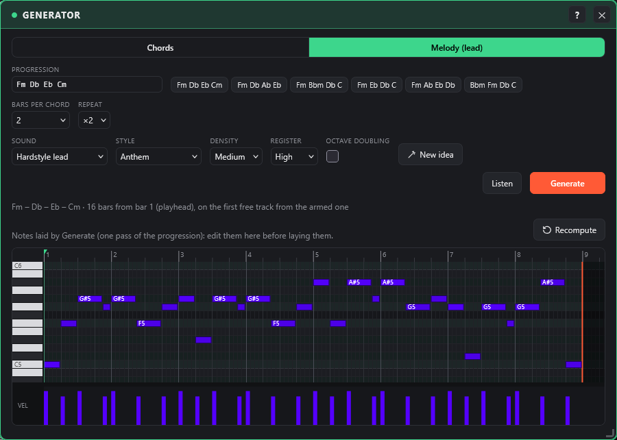
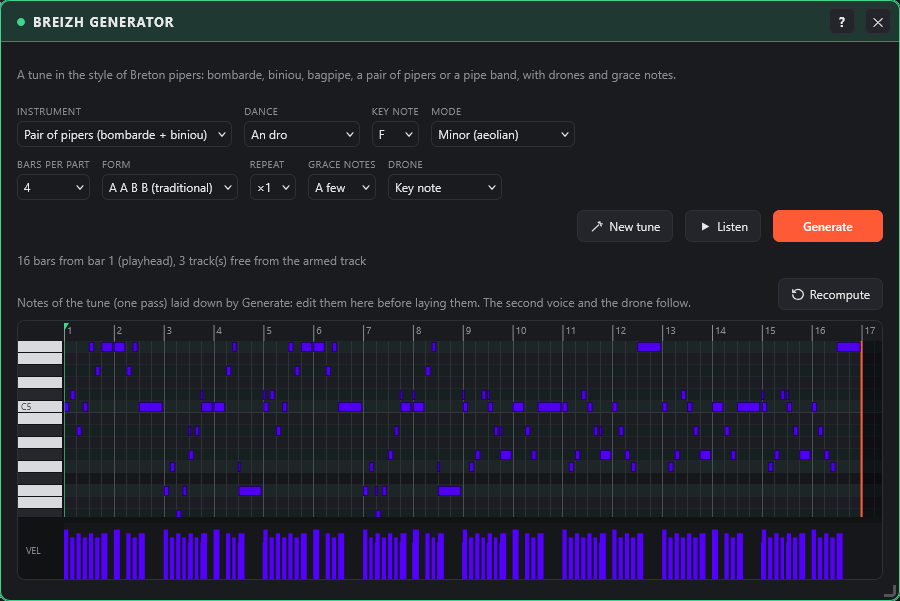

# Generator: chords and melody

← [Instruments](instruments.md) · [Contents](README.md) · [Mixing and effects](mixing.md) →

The **Generator** window (plugin bar, Tools group) starts from a chord progression and lays on the timeline, in two tabs, either **chord blocks** (strings, pads, choirs…) or a **melody (lead)** that follows those chords.

**Chords**

- **Progression**: type the chords separated by spaces or dashes (`Fm Db Eb Cm`, `Fm-Bbm-Db-C`…), or click a ready-made one. Recognised: major (`Db`), minor (`Fm`), `7`, `m7`, `maj7`, `sus2`, `sus4`, `dim`, `aug`, `5`, `add9`, with `#` / `b`.
- **Sound**: the current synth preset, or a preset from the strings, pads, choirs, supersaw, stabs or keys families. Each block keeps **its own preset**: you can play something else on the keyboard, or change preset, without changing the pads.
- **Register** (low, middle, high), **bars per chord** (1, 2 or 4), **repeat** (×1, ×2, ×4), **rhythm** (held, every beat, offbeat, 8th notes).
- **Bass**: none, sub (held), hardcore offbeat or reese (held), on the root of each chord, on a second track.
- The chords follow each other with smooth **voice leading**: common notes are kept and the others move as little as possible.
- **▶ Listen** plays the first chord; **Generate** places the blocks from the playhead's bar, on the first track that is free for the whole length, starting from the armed track. The timeline grows if needed.

A chord block works like any other block: move it, lengthen it, copy it (Alt), open it in the piano roll (double-click) or delete it.

**Melody (lead)**

- Same **progression**, **bars per chord** and **repeat** as the Chords tab: the melody follows the harmony.
- **Style**: **Anthem** (a motif replayed on each chord, like a hardcore anthem hook), **Arpeggio**, **Hardcore riff** (short notes, octaves and fifths), **Call and response** (a phrase that rises, an answer that falls). Strong beats land on the chord notes; in between, the melody walks the scale (on a major chord in F minor, such as C, it takes E natural).
- **Sound** (supersaw, leads, hoovers, stabs or the current synth preset), **density** (sparse, medium, dense), **register** (middle, high), **octave doubling**.
- **New idea** draws another melody and plays it; **Listen** plays exactly what **Generate** will lay down (click again to stop).
- The melody is laid as **a single note block**, repeated over the whole length: double-click it to edit it note by note in the piano roll.

**Editing the notes before laying them**

- Below the settings, a **piano roll** shows the **draft** of the displayed tab: the notes of one pass of the progression (the chords in the Chords tab, the melody in the Melody tab). Edit it like the [piano roll](timeline.md): click = add a note, drag = move, right edge = length, right-click = delete, Shift + drag = select; Ctrl+C / Ctrl+V / Delete / arrow keys when it has the focus.
- As long as the draft has not been edited, every setting recomputes it. Once **edited by hand**, the settings no longer change it: **Recompute** starts again from the settings (so does New idea, for the melody).
- **Listen** and **Generate** use the draft as shown. Chords are laid as one note block per chord (each keeps its name), the melody as a single block. The draft is saved with the project.

**Suggestions (no neural network)**

- **Suggestions** (Melody tab): the Generator tries about a hundred melodies on your progression and offers the **three best**, different from each other. The score comes from anthem hook rules: strong beats on the chord notes, mostly stepwise motion, few big leaps, a range of about an octave, a motif repeated from one chord to the next, a peak near the end of the phrase, an ending on the root.
- **Listen** to an idea, then **Choose** it: it becomes the melody draft. Each pick **learns your taste** (the average traits of the ideas you chose): later suggestions get closer and closer to it. The taste is saved with the project.
- **Suggest progressions** (Chords tab): anthem chord progressions in the key of your progression, built from the most common moves of minor-key hardcore and hardstyle (i, VI, VII, III, iv, v, V); click one to use it.

## Breizh generator

The **Breizh generator** window (Tools group) lays down a tune in the style of Breton pipers, played by Breton instruments, with its drone. It works like the Melody tab: a draft in the piano roll, **Listen**, **New tune**, **Generate**.

- **Instrument**: bombarde (double reed, loud and nasal), biniou kozh (small, very high Breton bagpipe), bagpipe, **pair of pipers** or **bagad**.
  - Pair: the bombarde and the biniou play together, the biniou an octave higher; the bombarde breathes at the end of each two-bar phrase while the biniou goes on.
  - Bagad: a section of bagpipes (several slightly detuned chanters), the bombardes an octave lower.
- **Dance**: the rhythm of the tune.
  - **An dro**: steady eighth notes.
  - **Gavotte**: syncopated.
  - **March**: dotted rhythm.
  - **Gwerz**: slow air, long notes.
- **Key note** and **mode**: minor (aeolian), dorian, mixolydian (the bagpipe's mode) or major. For an anthem in F minor, choose F and minor (or dorian).
- **Form**: **A A B B** like a traditional tune (each part played twice, part B higher) or a single part **A**. Each part is a question that stops on the fifth, then an answer that comes back to the key note; the third bar takes up the motif of the first so the tune sticks.
- **Bars per part** (2 or 4) and **repeat**.
- **Grace notes**: very short notes just before the notes on the beat, the signature of pipers. For the bagpipe and the bagad, the top note of the chanter; for the bombarde and the biniou, the note above. **Many** adds them more often, sometimes two in a row.
- **Drone**: the key note held for the whole length, over two octaves (and the fifth with **Key note + fifth**), on its own track.

**Generate** lays one block per voice (melody, second voice, drone) from the playhead bar, on free tracks from the armed track. The draft shown is the melody: edit it, the second voice and the drone follow.

The sounds are also in the synth, family **Breizh**: bombarde, biniou kozh, bagpipe, pipe band and drone. They are synthesized (reed waveforms and bell resonances), with no samples.

---

← [Instruments](instruments.md) · [Contents](README.md) · [Mixing and effects](mixing.md) →
