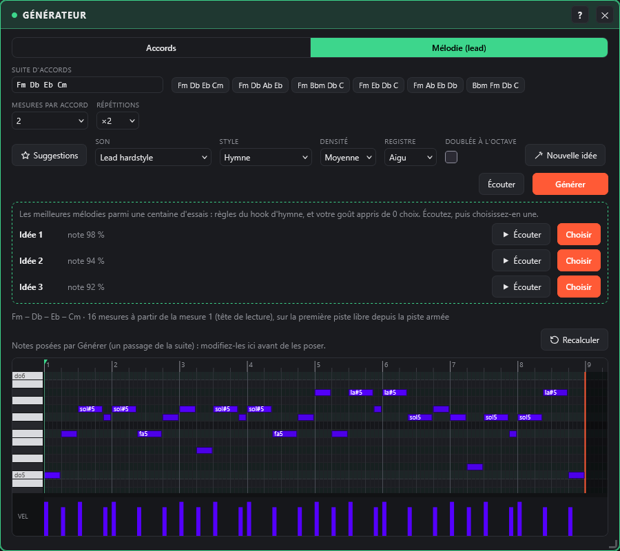
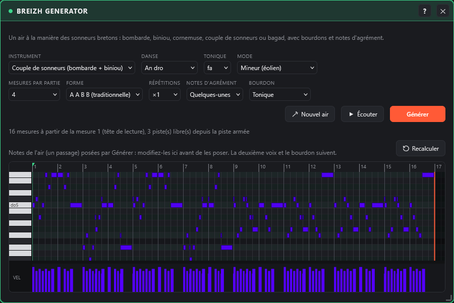

# Générateur : accords et mélodie

← [Instruments](instruments.md) · [Sommaire](README.md) · [Mixage et effets](mixage.md) →

La fenêtre **Générateur** (barre des plugins, groupe Outils) part d'une suite d'accords et pose sur la timeline, au choix (deux onglets), des **blocs d'accords** (cordes, nappes, chœurs…) ou une **mélodie (lead)** qui suit ces accords.

**Accords**

- **Suite d'accords** : tapez les accords séparés par des espaces ou des tirets (`Fm Db Eb Cm`, `Fm-Bbm-Db-C`…), ou cliquez sur une suite toute prête. Reconnus : majeur (`Db`), mineur (`Fm`), `7`, `m7`, `maj7`, `sus2`, `sus4`, `dim`, `aug`, `5`, `add9`, avec `#` / `b`.
- **Son** : le preset du synthé en cours, ou un preset parmi les familles cordes, nappes, chœurs, supersaw, stabs ou claviers. Chaque bloc garde **son propre preset** : vous pouvez jouer autre chose au clavier, ou changer de preset, sans changer les nappes.
- **Registre** (grave, médium, aigu), **mesures par accord** (1, 2 ou 4), **répétitions** (×1, ×2, ×4), **rythme** (tenu, chaque temps, contretemps, croches).
- **Basse** : aucune, sub (tenue), hardcore en contretemps ou reese (tenue), sur la fondamentale de chaque accord, sur une deuxième piste.
- Les accords s'enchaînent en douceur : les notes communes sont gardées et les autres bougent le moins possible.
- **▶ Écouter** joue le premier accord ; **Générer** pose les blocs à partir de la mesure de la tête de lecture, sur la première piste libre sur toute la durée, en partant de la piste armée. La timeline s'allonge si besoin.

Un bloc d'accord se manipule comme les autres : le déplacer, l'allonger, le copier (Alt), l'ouvrir dans le piano roll (double-clic) ou le supprimer.

**Mélodie (lead)**

- Même **suite d'accords**, mêmes **mesures par accord** et **répétitions** que l'onglet Accords : la mélodie suit l'harmonie.
- **Style** : **Hymne** (un motif repris sur chaque accord, comme un hook d'hymne hardcore), **Arpège**, **Riff hardcore** (notes courtes, octaves et quintes), **Question / réponse** (une phrase qui monte, une réponse qui descend). Les temps forts tombent sur les notes de l'accord ; entre eux, la mélodie passe par la gamme (sur un accord majeur en fa mineur, comme do, elle prend le mi bécarre).
- **Son** (supersaw, leads, hoovers, stabs ou le preset du synthé en cours), **densité** (aérée, moyenne, dense), **registre** (médium, aigu), **doublée à l'octave**.
- **Nouvelle idée** tire une autre mélodie et la fait écouter ; **Écouter** joue exactement ce que **Générer** posera (un deuxième clic arrête).
- La mélodie est posée en **un seul bloc de notes**, répété sur toute la durée : double-cliquez dessus pour la retoucher note par note dans le piano roll.

**Modifier les notes avant de les poser**

- Sous les réglages, un **piano roll** montre le **brouillon** de l'onglet affiché : les notes d'un passage de la suite d'accords (les accords dans l'onglet Accords, la mélodie dans l'onglet Mélodie). Il s'édite comme le [piano roll](timeline.md) : clic = poser une note, glisser = déplacer, bord droit = durée, clic droit = effacer, Maj + glisser = sélection ; touches Ctrl+C / Ctrl+V / Suppr / flèches quand il a le focus.
- Tant que le brouillon n'a pas été retouché, chaque réglage le recalcule. Une fois **retouché à la main**, les réglages ne le changent plus : **Recalculer** repart des réglages (Nouvelle idée aussi, pour la mélodie).
- **Écouter** et **Générer** utilisent le brouillon tel qu'il est affiché. Les accords sont posés en un bloc de notes par accord (chacun garde son nom), la mélodie en un seul bloc. Le brouillon est enregistré avec le projet.

**Suggestions (sans réseau de neurones)**

- **Suggestions** (onglet Mélodie) : le Générateur essaie une centaine de mélodies sur votre suite et vous propose les **trois meilleures**, différentes entre elles. La note vient de règles de hook d'hymne : temps forts sur les notes de l'accord, mouvements surtout conjoints, peu de grands sauts, ambitus d'environ une octave, motif repris d'un accord à l'autre, sommet vers la fin de la phrase, fin sur la fondamentale.
- **Écouter** une idée, puis **Choisir** : elle devient le brouillon de la mélodie. Chaque choix **apprend votre goût** (la moyenne des traits des idées choisies) : les suggestions suivantes s'en rapprochent de plus en plus. Le goût est enregistré avec le projet.
- **Suggérer des suites** (onglet Accords) : des suites d'accords d'hymne dans la tonalité de votre suite, construites à partir des enchaînements les plus courants du hardcore et du hardstyle en mineur (i, VI, VII, III, iv, v, V) ; un clic en utilise une.

## Breizh generator

La fenêtre **Breizh generator** (groupe Outils) pose un air à la manière des sonneurs bretons, joué par des instruments bretons, avec son bourdon. Elle marche comme l'onglet Mélodie : un brouillon dans le piano roll, **Écouter**, **Nouvel air**, **Générer**.

- **Instrument** : bombarde (anche double, son puissant et nasillard), biniou kozh (petite cornemuse bretonne, très aiguë), cornemuse, **couple de sonneurs** ou **bagad**.
  - Couple : la bombarde et le biniou jouent ensemble, le biniou à l'octave au-dessus ; la bombarde respire à la fin de chaque phrase de deux mesures pendant que le biniou continue.
  - Bagad : un pupitre de cornemuses (plusieurs chalumeaux un peu désaccordés), les bombardes à l'octave au-dessous.
- **Danse** : le rythme de l'air.
  - **An dro** : croches régulières.
  - **Gavotte** : syncopée.
  - **Marche** : rythme pointé.
  - **Gwerz** : air lent, notes longues.
- **Tonique** et **mode** : mineur (éolien), dorien, mixolydien (le mode de la cornemuse) ou majeur. Pour un hymne en fa mineur, prenez fa et mineur (ou dorien).
- **Forme** : **A A B B** comme un air traditionnel (chaque partie jouée deux fois, la partie B plus haute) ou une seule partie **A**. Chaque partie est une question qui s'arrête sur la quinte, puis une réponse qui revient à la tonique ; la troisième mesure reprend le motif de la première pour que l'air se retienne.
- **Mesures par partie** (2 ou 4) et **répétitions**.
- **Notes d'agrément** : des notes très courtes juste avant les notes posées sur le temps, la signature des sonneurs. Pour la cornemuse et le bagad, la note la plus haute du chalumeau (comme les « gracenotes ») ; pour la bombarde et le biniou, la note au-dessus. **Beaucoup** en met plus souvent, parfois deux de suite.
- **Bourdon** : la tonique tenue sur toute la durée, sur deux octaves (et la quinte avec **Tonique + quinte**), sur sa propre piste.

**Générer** pose un bloc par voix (mélodie, deuxième voix, bourdon) à partir de la mesure de la tête de lecture, sur des pistes libres depuis la piste armée. Le brouillon affiché est l'air de la mélodie : retouchez-le, la deuxième voix et le bourdon suivent.

Les sons existent aussi dans le synthé, famille **Breizh** : bombarde, biniou kozh, cornemuse, bagad (pupitre) et bourdon. Ils sont synthétisés (formes d'onde d'anche et résonances du pavillon), sans échantillon.

---

← [Instruments](instruments.md) · [Sommaire](README.md) · [Mixage et effets](mixage.md) →
