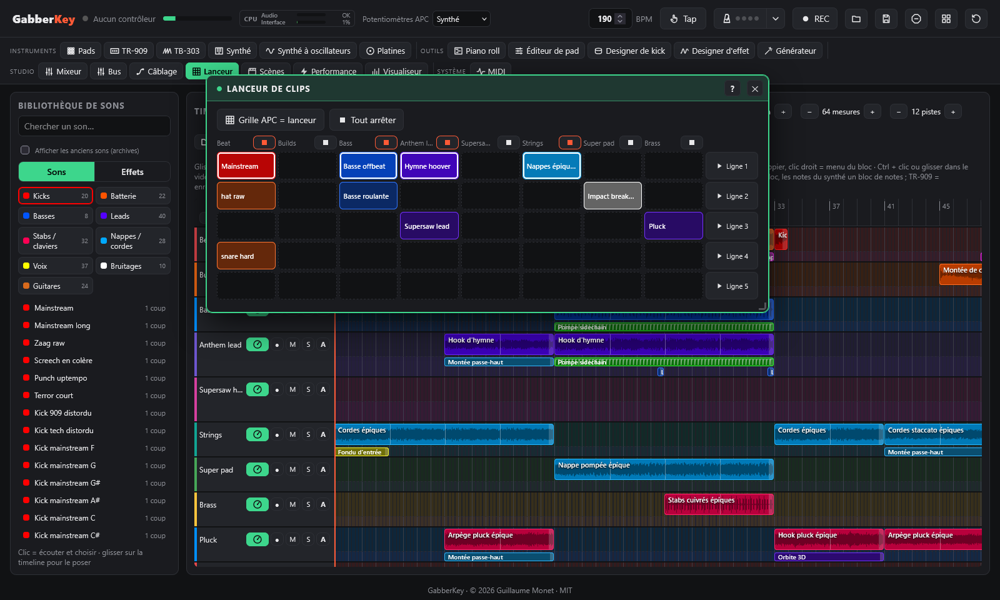

# Live : platines, scènes, visualiseur

← [Mixage et effets](mixage.md) · [Sommaire](README.md) · [Fichiers et enregistrement](fichiers.md) →

Les outils pour jouer en public : platines, scènes, visualiseur et fenêtres des plugins.

## Platines

Deux decks pour mixer et scratcher n'importe quel son : boucles de la bibliothèque, vos enregistrements, vos propres fichiers audio.

- **Charger** : glissez un son de la bibliothèque (ou un fichier audio) sur un deck, ou cliquez sur un son de la bibliothèque puis sur **Charger**.
- **▶ / ❚❚** lecture / pause. **Cue** : en lecture, retour au point de cue et pause ; à l'arrêt, place le point de cue. Clic sur la forme d'onde pour s'y rendre.
- **Sync** : le deck suit le tempo global (quand le tempo du son est connu : boucles de la bibliothèque, ou deviné pour les longs fichiers), continue de le suivre quand vous changez le tempo, et démarre à la mesure suivante. Sans Sync, le curseur **Pitch** change la vitesse de ±8 %.
- **Scratch** : tenez le disque à la souris et bougez-le, en avant ou en arrière ; relâchez-le pour qu'il reparte. Comme sur une vraie platine, le disque suit la **position** de la main (pas sa vitesse), avec un peu d'inertie qui gomme les à-coups de la souris ; relâché, il garde l'élan de la main et le moteur le ramène à sa vitesse en un dixième de seconde. Le son est lu par un processeur audio dédié (interpolation sur 4 points, anti-crénelage quand ça va vite) : il joue vraiment à l'envers et suit la main.
- **Affichage** : une forme d'onde zoomée qui défile sous la tête de lecture, 4 mesures avec la grille des temps et les mesures numérotées, basses en orange (pour caler les kicks à l'œil) ; le son entier en dessous (clic pour s'y placer) ; le plateau avec ses points stroboscopiques, le disque et son étiquette, et le bras de lecture.
- **Transition auto** (à côté du crossfader) : mixe du deck qui joue vers l'autre, en choisissant la meilleure façon. L'arrivant part pile sur la prochaine **phrase** de celui qui joue (8 mesures, ou 4 si attendre 8 mesures serait trop long), en phase. La transition dure **16 mesures** quand le son qui arrive commence calme (une intro), **8** sinon, moins si celui qui part se termine avant. L'arrivant entre sans basses et un peu filtré, le crossfader va au milieu, les **basses s'échangent** net sur la mesure du milieu, puis le partant s'éloigne (filtre passe-haut, aigus baissés) et s'arrête ; ses réglages reviennent au neutre. On voit les potentiomètres bouger. Sans tempo connu : un fondu de 8 secondes. Toucher les platines (crossfader, potentiomètre, disque, ▶) reprend la main ; un nouveau clic sur le bouton l'arrête.
- Pour chaque deck : **Volume**, **Basses**, **Médiums**, **Aigus** (tout à gauche = coupé) et un **Filtre** DJ (à gauche = passe-bas, à droite = passe-haut) ; un **crossfader** à puissance constante entre A et B.
- Sur l'APC, **Maj + REC** deux fois ouvre la page de potentiomètres des platines (K1-K3 = volume, basses, filtre du deck A ; K4-K6 = deck B ; K7 = crossfader ; K8 = master). Les platines ont leur voie de mixage (K6 sur les pages mixeur) et peuvent être enregistrées dans la timeline (source Platines).

## Lanceur de clips

Jouez le morceau en direct, clip par clip, comme sur scène. La fenêtre **Lanceur** (barre des plugins, groupe Studio) a **8 colonnes**, les 8 premières pistes de la timeline, et **5 lignes** de cases.

- **Remplir une case** : glissez-y un son de la bibliothèque, ou clic droit sur un bloc de la timeline › **Envoyer au lanceur** (il va dans la colonne de sa piste, première case libre). Clic droit sur une case pour la vider.
- **Lancer** : un clic sur une case la fait tourner **en boucle à partir de la mesure suivante**, à la place du clip qui tournait dans sa colonne (une case qui attend sa mesure clignote). Elle passe par les potentiomètres et les effets d'insert de sa piste.
- **Ligne N** lance toute une ligne ; le carré ■ d'une colonne l'arrête ; **Tout arrêter** arrête tous les clips à la mesure suivante. **Panique** coupe tout immédiatement.
- Les clips suivent les mesures de la timeline quand elle joue (et la grille de la TR-909) ; sinon, le premier clip lancé part tout de suite et donne les mesures.
- **Grille APC = lanceur** : les **40 pads** de l'APC deviennent les cases (rangée du haut = ligne 1), **SCENE LAUNCH 1-5** lancent les lignes, **STOP ALL** arrête tous les clips, **Maj + pad** arrête sa colonne. Les LED montrent les cases pleines, celle qui joue (pulsation) et celle qui attend (clignotement rapide).
- Les cases sont enregistrées avec le projet et s'annulent avec Ctrl+Z.

## Scènes

40 scènes disposées comme la grille de l'APC (1-8 en bas). Une scène mémorise :
- les boucles lancées ;
- le pattern de la TR-909 et ses instruments muets ;
- les niveaux, panoramiques, envois, muets et solos de la table de mixage ;
- le preset du synthé, le tempo, et l'état lecture ou arrêt.

- **Lancer** : clic sur une scène. Tout bascule **à la mesure suivante** : les nouvelles boucles démarrent, les autres s'arrêtent, les patterns changent et le mixeur suit.
- **Enregistrer** l'état actuel : Maj + clic, ou activez le **Mode enregistrement**. Un clic droit efface une scène.
- **APC** : **Maj + STOP ALL CLIPS** transforme la grille de pads en 40 scènes. Pad = lancer, Maj + pad = enregistrer, Maj + STOP ALL CLIPS à nouveau (ou un bouton SCENE LAUNCH) pour revenir. LEDs : vert = enregistrée, rouge = en cours, clignotant = en attente de la mesure suivante.

## Visualiseur

Un clin d'œil à Winamp, dans le groupe **Studio** : des visualisations de la musique qui suivent la sortie générale, faites pour être projetées en **plein écran** pendant un live.

- **Spectre** : des barres de LED des graves aux aigus (vert, jaune, rouge) avec des crêtes qui retombent doucement, et leur reflet.
- **Oscilloscope** : la forme d'onde lumineuse avec sa traînée, et une figure stéréo dans le coin.
- **Milk** : chaque image est réinjectée, zoomée et tournée, sous un cercle fait de la forme d'onde et des formes qui tournent : tourbillons et traînées qui cognent à chaque kick.
- **Vumètres** : deux vumètres à aiguille façon hi-fi (gauche / droite, avec voyants de crête) et une barre de LED par voie de mixage et pour le master.
- **Texte qui cogne** : vos propres mots (séparés par des virgules), un par mesure, écrasés sur chaque kick avec des couleurs séparées.
- **3D (WebGL)** : un **tunnel** de néons qui défile au tempo, un **paysage** synthwave dont le relief est le spectre des deux dernières mesures, un **blob** (une sphère déformée par le son), l'**hyperespace** (des étoiles qui filent vers vous, un saut à chaque kick), une **fractale 3D** (un vol dans une éponge de Menger infinie) et des **lasers** qui balaient la fumée au-dessus d'une foule qui saute.
- **Particules** (une sphère de points qui éclate à chaque kick), **barres Amiga** avec défileur sinusoïdal, **spectrogramme**, et d'autres modes 3D / GPU : **ville de spectre** (des tours de néon faites de l'historique du spectre), **mur de LED**, **metaballs**, **plasma**, **rotozoomer**, **fluide** et **réaction-diffusion**.
- **Filtres empilables** sur n'importe quel mode : **CRT**, **kaléidoscope**, **glitch** et **stroboscope** (3 flashs par seconde au plus). Changer de mode fait une transition (fondu, zoom ou bandes).
- **Potentiomètres** (à l'écran, et sur l'APC quand la fenêtre est active) : vitesse, teinte, force des flashs, sensibilité et quantité de chaque filtre.
- **Détection du drop** : quand les graves reviennent après un break, l'image explose (et change de mode en Auto).
- **Projecteur** : les visuels seuls dans une **deuxième fenêtre**, à glisser sur l'écran du projecteur et à mettre en plein écran (double-clic) pendant que vous continuez de jouer dans la fenêtre principale.
- Les couleurs avancent avec le tempo et chaque **kick** fait un flash. **Auto** change de mode toutes les 8 mesures. **Plein écran** (ou F, ou un double-clic) : un clic passe au mode suivant, Échap pour sortir. Les touches 1 à 9 et 0 choisissent le mode. Rien n'est dessiné quand la fenêtre est fermée.

## Fenêtres des plugins

La barre sous l'en-tête ouvre et ferme les plugins, en quatre groupes : **Instruments** (Pads, TR-909, TB-303, Synthé, Synthé à oscillateurs, Platines), **Outils** (Piano roll, Éditeur de pad, Designer de kick, Designer d'effet, Générateur), **Studio** (Mixeur, Bus, Câblage, Lanceur, Scènes, Performance, Visualiseur) et **Système** (MIDI : claviers, MIDI learn, moniteur). Chacun s'ouvre dans une fenêtre au-dessus de la timeline :
- Chaque fenêtre a une barre de titre : le **titre** à gauche, **?** et **✕** à droite.
- La **fenêtre active** (au premier plan) est mise en valeur ; les fenêtres s'ouvrent et se ferment avec une transition 3D.
- **Déplacez**-la par sa barre de titre, **redimensionnez**-la par son coin en bas à droite ; elle **s'aimante** aux bords de l'écran et aux autres fenêtres.
- **?** ouvre l'**aide** du contenu de la fenêtre, à côté d'elle (**?** à nouveau, ✕ ou Échap la ferme).
- **✕** la ferme ; les fenêtres utilisées sont mémorisées avec leur position.
- Les outils dont on peut enregistrer les réglages (TR-909, TB-303, Synthé, Synthé à oscillateurs, Designer de kick, Mixeur, Câblage, Scènes) ont aussi des boutons **📁 / 💾** dans leur barre de titre (voir Enregistrer et ouvrir).
- Le bouton **Réorganiser les fenêtres** (quatre carrés, dans l'en-tête) les remet à leur place et à leur taille de départ.

---

← [Mixage et effets](mixage.md) · [Sommaire](README.md) · [Fichiers et enregistrement](fichiers.md) →
