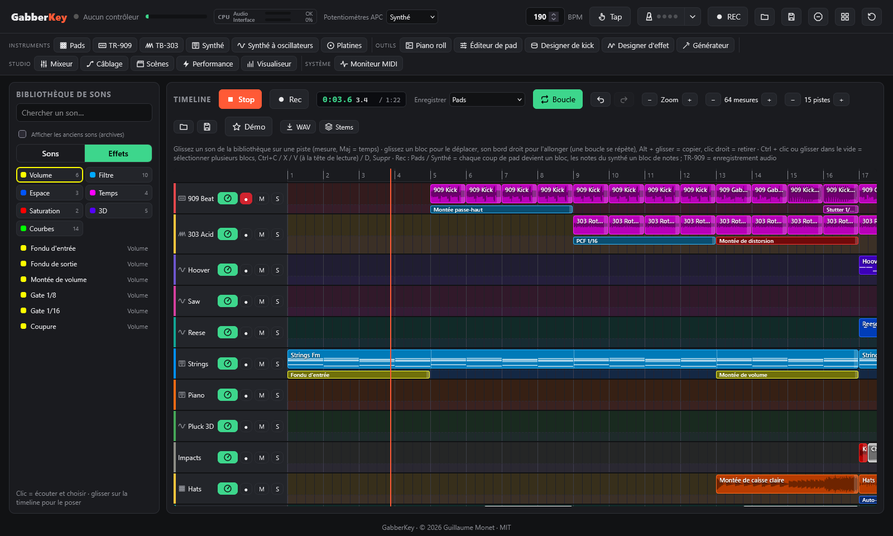
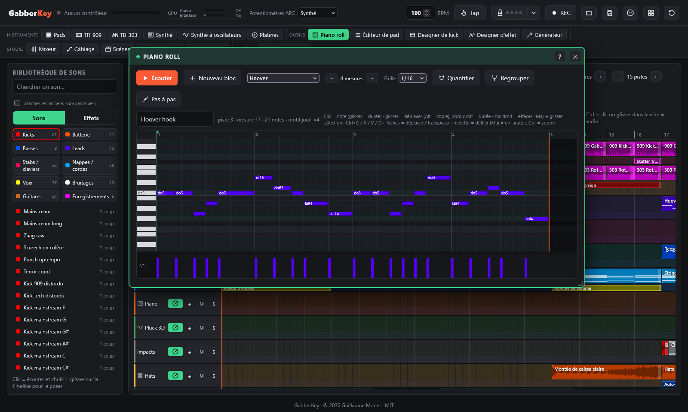
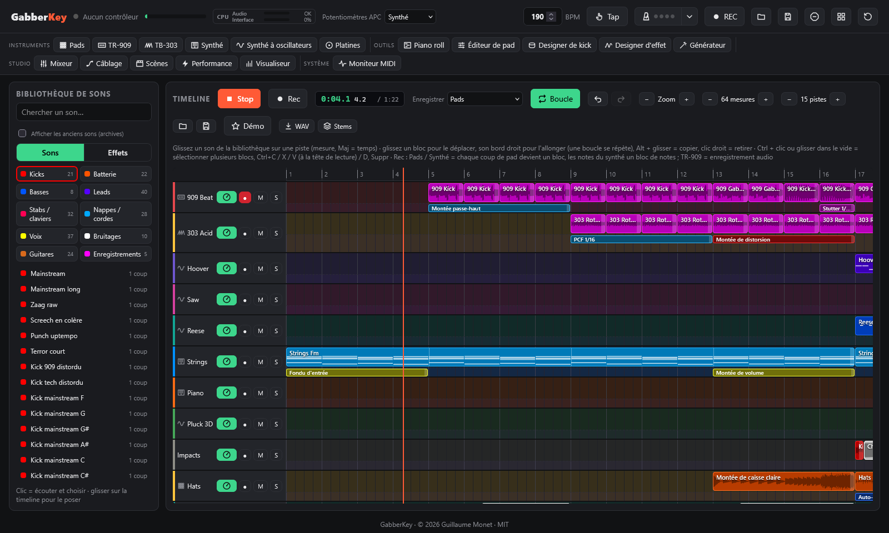

# Timeline, bibliothèque et piano roll

← [Pads et banques](pads.md) · [Sommaire](README.md) · [Instruments](instruments.md) →

L'écran principal : pistes, blocs, bibliothèque de sons, effets de piste, piano roll et démos.

## Timeline et bibliothèque de sons

L'écran principal : la **bibliothèque de sons** à gauche, la **timeline** à droite (16 pistes et 32 mesures au départ, − / + pour changer la longueur et le nombre de pistes, de 4 à 64, zoom, **Boucle**).

- **Bibliothèque** : deux onglets. **Sons** : choisissez une catégorie (Kicks, Batterie, Basses, Leads, Stabs / claviers, Nappes / cordes, Voix, Bruitages, Guitares, Mes sons, Enregistrements). **Effets** : les effets de piste, par famille (Volume, Filtre, Espace, Temps, Saturation, 3D, et vos Courbes du designer d'effet). Ou cherchez par nom. Un **clic** sur un son l'écoute (et le choisit) ; l'étiquette indique sa longueur en mesures (boucles) ou « 1 coup ».
- **Poser** : glissez un son sur une piste. Il se cale au début de la mesure (gardez **Maj** enfoncée pour le poser sur un temps). Un clic dans une case vide pose le dernier son choisi.
- **Modifier les blocs** : glissez un bloc pour le déplacer (vers une autre mesure ou une autre piste), tirez son **bord droit** pour l'allonger ou le raccourcir (une boucle se répète pour remplir le bloc), **Alt + glisser** le copie, un **double-clic** l'écoute (un bloc de notes s'ouvre dans le **piano roll**), un **clic droit** ou **Suppr** le retire.
- **Temps de lecture** (à côté de Rec) : le temps écoulé depuis le début du morceau, la position mesure.temps, et la durée du morceau (jusqu'à la fin de son dernier bloc) ; il suit la tête de lecture, en lecture ou quand vous la déplacez.
- **Écouter un bloc** : le bouton **▶** qui apparaît sur un bloc au survol de la souris (ou un double-clic sur un bloc de son) joue ce bloc seul, tel qu'il sonne dans le morceau : au tempo, sur toute sa longueur, avec les potentiomètres de sa piste (mais sans ses effets de piste) ; une barre avance sur le bloc et **■** l'arrête. Le morceau n'est pas dérangé s'il joue.
- **Nom et couleur** : double-clic sur le nom d'une piste pour la renommer ; son panneau (bouton cadran) propose aussi le nom et une couleur de fond pour la piste.
- **Potentiomètres de piste** : le bouton cadran de chaque piste ouvre son panneau et ses potentiomètres : **volume**, **pano**, filtres **passe-bas** et **passe-haut**, envois **delay** et **reverb**. Ils agissent sur tout ce que joue la piste, sont enregistrés avec le morceau, s'annulent avec Ctrl+Z et sont inclus dans l'export WAV et les stems. Le bouton s'allume dès qu'un potentiomètre n'est plus à sa valeur par défaut ; **Remise à zéro** les remet tous.
- **Muet et solo** : **M** coupe la piste, **S** la met en solo (on n'entend plus que les pistes en solo ; plusieurs pistes peuvent l'être). Ils agissent tout de suite, même en pleine lecture, et l'export WAV suit ce qu'on entend. Une piste muette ne déclenche pas le sidechain.
- **Effets d'insert** : dans le panneau d'une piste, **Ajouter un effet** place jusqu'à 4 effets **toujours actifs** sur toute la piste : égaliseur 3 bandes, compresseur, distorsion, filtre, reverb. Ils passent avant les potentiomètres de la piste ; double-clic sur un réglage = valeur par défaut. Les **blocs d'effet** (ci-dessous) n'agissent, eux, que pendant leur durée.
- **Sélectionner plusieurs blocs** : **Ctrl + clic** ajoute un bloc à la sélection (ou le retire), **glisser dans le vide** trace un cadre de sélection (Maj ou Ctrl pour ajouter à la sélection), **Ctrl+A** sélectionne tout. Glissez l'un d'eux pour déplacer tout le groupe (Alt = le copier). Les blocs d'effet des pistes se sélectionnent de la même façon.
- **Copier / coller** : **Ctrl+C** / **Ctrl+X**, puis **Ctrl+V** colle à la tête de lecture, sur les mêmes pistes (la tête de lecture passe à la fin du collage : un nouvel appui enchaîne les copies) ; **Ctrl+D** duplique la sélection juste après elle ; **Suppr** la retire ; **Échap** désélectionne.
- **Annuler / rétablir** : **↶ / ↷** dans la barre, ou **Ctrl+Z** / **Ctrl+Maj+Z** (ou **Ctrl+Y**). Toute modification de la timeline peut être annulée (blocs posés, déplacés, allongés ou supprimés, nappes générées, enregistrements, chargement de la démo…), jusqu'à 100 étapes.
- **Enregistrer en jouant (live)** : armez une ou **plusieurs pistes** (●), choisissez dans le panneau de chaque piste l'**instrument qu'elle enregistre** (Pads, Synthé, Synthé à oscillateurs, TR-909, TB-303, Platines, ou Auto = le menu **Enregistrer** de la barre ; l'en-tête de la piste montre son icône), placez la tête de lecture (clic sur la règle), puis **● Rec** (ou REC sur l'APC). Chaque piste armée enregistre son instrument en même temps, et la timeline joue (en boucle si Boucle est activé, sauf si un instrument s'enregistre en audio) :
  - **Pads** : chaque coup de pad devient un bloc de ce pad, là où vous l'avez frappé (calé à la double-croche). Le bloc rejoue le pad avec ses réglages.
  - **Synthé** : chaque note apparaît en direct et **s'allonge tant que vous tenez la touche** ; à l'arrêt, les notes de la prise deviennent **un seul bloc de notes** (d'une mesure à l'autre), qui rejoue avec le synthé joué (preset du synthé en cours, ou le synthé à oscillateurs) et s'ouvre dans le piano roll.
  - Les blocs apparaissent en direct pendant que vous jouez, sur la piste qui enregistre l'instrument. Si elle est occupée à ce moment-là, le bloc va sur la piste libre suivante (jamais sur une piste armée pour un autre instrument). Les notes vont à la piste du synthé que joue le clavier. Avec Boucle, vous pouvez ajouter des coups à chaque passage.
  - **TR-909** / **TB-303** / **Platines** : l'instrument démarre calé sur les mesures de la timeline et s'enregistre en audio dans un bloc (aussi rangé dans la bibliothèque, rubrique Enregistrements).
  - **■ Arrêter rec** (ou REC à nouveau) termine l'enregistrement.
- **Lire** : ▶ (ou PLAY sur l'APC) joue depuis la tête de lecture, et le même bouton arrête ; la vue suit la tête de lecture. Les boucles faites à un autre tempo suivent le tempo global. La timeline a sa propre voie dans la table de mixage.

### Effets de piste

Chaque piste a deux parties : les **sons** en haut, et une fine **ligne d'effets** en dessous. Glissez un effet de la catégorie **Effets de piste** de la bibliothèque sur une piste : il agit sur **tout ce que joue la piste** (blocs audio, notes et accords du synthé, coups de pads) **pendant la durée du bloc**, calé sur le tempo. Les effets se cumulent : un fondu d'entrée et un PCF en même temps s'appliquent tous les deux ; les blocs d'effet qui se chevauchent s'empilent sur plusieurs lignes.

- **Modifier** un bloc d'effet comme un bloc de son : le glisser (Alt = copie), tirer son bord droit pour changer sa longueur, clic droit ou **Suppr** pour le retirer, **double-clic** pour ouvrir ses réglages.
- **La banque d'effets** (30 effets, chacun avec ses réglages) :

| Famille | Effets |
|---|---|
| Volume | Fondu d'entrée, Fondu de sortie, Montée de volume, Gate 1/8 et 1/16, Coupure |
| Filtre | Montée passe-haut, Fermeture passe-bas, Wobble 1/4 et 1/8, **PCF** 1/8, 1/16, contretemps, galop, 3-3-2, passe-bande |
| Espace | Lancer de reverb, Lancer de delay (les échos continuent après le bloc), Auto-pan |
| Temps | Stutter 1/8, 1/16, 1/32, Tape stop |
| Saturation | Montée de distorsion, Montée de bitcrush |
| 3D | Orbite 3D, Passage 3D, Zoom avant / arrière 3D, Spirale 3D (binaural : idéal au casque) |

- Le **PCF** est un filtre rythmique : passe-bas (LP) ou passe-bande (BP), dont l'enveloppe repart à chaque pas actif d'un **motif** de 16 pas (1/8, 1/16, 1/4, contretemps, galop, 3-3-2, roulement), avec **Fréquence**, **Q**, **Quantité** et **Déclin**.
- Tout est programmé sur l'horloge audio : les effets restent calés, s'annulent avec Ctrl+Z, et sont inclus dans l'export WAV et les stems.

## Piano roll

Éditez les notes d'un **bloc de notes** de la timeline (enregistrements du synthé, nappes générées, accords, arpèges, ou un nouveau bloc).

- **Ouvrir un bloc** : double-clic sur un bloc de notes de la timeline (quand la fenêtre est ouverte, un clic suffit), ou **+ Nouveau bloc** (1 mesure à la tête de lecture, sur la piste armée). Un **enregistrement du synthé devient un seul bloc de notes**, prêt à être retouché.
- **Dessiner** : clic dans le vide pour poser une note (glisser pour sa durée), glisser une note pour la déplacer (**Alt** = copie), tirer son bord droit pour sa durée, **clic droit** pour effacer. **Maj + glisser** sélectionne un groupe.
- **Touches** : Suppr, Ctrl+A / C / X / V (collage au curseur vert, placé d'un clic sur la règle), **Ctrl+D** duplique à la suite, ↑ / ↓ transposent (Maj = octave), ← / → déplacent d'une case (Maj = une mesure), **Q** quantifie, **Espace** écoute, Ctrl+Z annule.
- **Vélocité** : glisser dans la bande du bas.
- **Grille** de 1/4 à 1/32, avec les triolets ; **Quantifier** cale le début et la fin des notes. Les lignes de la gamme de fa mineur (la tonalité des banques) sont teintées.
- **Longueur** −/+ règle la longueur du **motif** : dans la timeline, le bloc le répète sur toute sa longueur (tirer son bord droit), comme une boucle. Des notes posées après la fin allongent le motif.
- **Son** : chaque bloc peut avoir son propre preset du synthé, ou jouer le son en cours au clavier. **Regrouper** rassemble en un seul les blocs de notes voisins de la piste (même son).
- **Pas à pas** : les notes jouées au clavier de l'APC (ou de l'ordinateur) sont posées au curseur, accords compris, et le curseur avance d'une case.
- **▶ Écouter** joue le motif seul en boucle ; pendant la lecture de la timeline, la tête de lecture s'affiche aussi dans le piano roll.

## Démo

Cliquez sur **Démo** dans la barre de la timeline et choisissez un morceau. Appuyez sur ▶ pour l'écouter, puis modifiez-le comme vous voulez.

- **Démo 1 : boucles de la bibliothèque** : environ une minute à 190 BPM en fa mineur, construit avec les banques Gabber, Hardcore et Oldschool (intro aux cordes, montée gabber avec hoovers, premier drop, break oldschool avec break façon Amen, piano et chœurs, second drop hardcore avec screech et cordes, final en roulement de kicks). À écouter : [`demo/gabberkey-demo.ogg`](../../demo/gabberkey-demo.ogg) (rendu par `tools/render_demo.py` à partir de `demo/demo.json`).
- **Démo 2 : tous les outils** : 64 mesures de hardcore à 190 BPM en fa mineur (Fm, Db, Eb, C), faites dans l'application avec un maximum d'outils, sur 15 pistes nommées et colorées :
  - la **TR-909** (kit Rotterdam) et la **TB-303** (son Rotterdam) enregistrées en direct : beat gabber, roulement de kick, kick seul, ligne acid et ligne « squelch » ;
  - le **synthé à oscillateurs** : mélodie au hoover, basse reese à contretemps, supersaw à l'octave, pluck (chaque mélodie est un bloc de notes qui s'ouvre au **piano roll**) ;
  - le **synthé à couches** : cordes épiques et stabs de piano rave ;
  - un kick du **designer de kick** (Terror) sur chaque drop ;
  - des sons de la bibliothèque : charleys, montées de caisse claire, risers, crashs, impacts, cris, screech, sirène, chœur ;
  - les **effets de piste** : filtre qui s'ouvre et se ferme, filtre pompant, saturation qui monte, wobble, stutter, tape stop, gate, envois de reverb et de delay, autopan, et la **3D** : orbite, spirale, passage et zoom ;
  - les **potentiomètres de piste** : volume, panoramique, filtres, envois delay et reverb.

  Intro aux cordes et sirène, montée (ligne acid, roulement de caisse claire, « hey ! »), premier drop, break au piano avec un pluck qui tourne autour de vous en 3D, second drop avec supersaw, final. À écouter : [`demo/gabberkey-demo-2.ogg`](../../demo/gabberkey-demo-2.ogg). C'est un fichier morceau ([`demo/gabberkey-demo-2.gabber`](../../demo/gabberkey-demo-2.gabber)) : les prises 909 / 303 et le kick du designer voyagent dedans.
- **Démos 3, 4 et 5**, faites uniquement avec la nouvelle bibliothèque **Anthem** (64 mesures à 190 BPM en fa mineur, environ 1:20 chacune), avec des effets de piste, des courbes du designer d'effet et de la 3D :
  - **Anthem** (grille épique Fm–Db–Eb–Cm) : intro aux cordes, montée au pluck qui s'ouvre au filtre passe-haut, un premier drop avec le lead d'hymne supersaw, basse et nappe pompées par des courbes de pompe sidechain, un break avec le pluck qui tourne en 3D, une montée en roulement de kick, et un second drop avec le beat en colère, le hook supersaw, les cuivres et un screech découpé en gate 3-3-2. À écouter : [`demo/gabberkey-demo-3.ogg`](../../demo/gabberkey-demo-3.ogg).
  - **Raw** (grille sombre Fm–Bbm–Db–C) : intro aux cordes sombres, beat raw qui s'ouvre au filtre passe-haut, un premier drop avec le lead sombre, la basse roulante et la nappe pompée, un break ouvert par un kick zaag long avec les cordes en spirale 3D, une montée en roulement de kick, et un second drop au beat en colère où arrivent le screech (courbe wobble, passage en 3D) et les stabs en ping-pong. À écouter : [`demo/gabberkey-demo-4.ogg`](../../demo/gabberkey-demo-4.ogg).
  - **Euphoric** (grille euphorique Fm–Db–Ab–Eb) : beat uptempo, lead euphorique, hooks trance avec une courbe d'écho à contretemps, une nappe qui gonfle et respire, un pluck qui arrive en zoom 3D, et une mélodie jouée avec les kicks accordés avant le dernier drop. À écouter : [`demo/gabberkey-demo-5.ogg`](../../demo/gabberkey-demo-5.ogg).

---

← [Pads et banques](pads.md) · [Sommaire](README.md) · [Instruments](instruments.md) →
